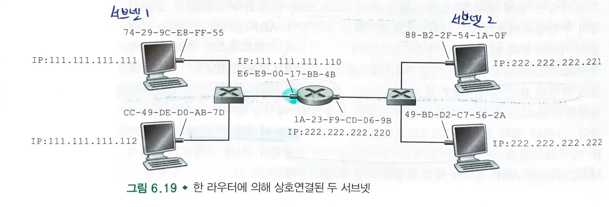
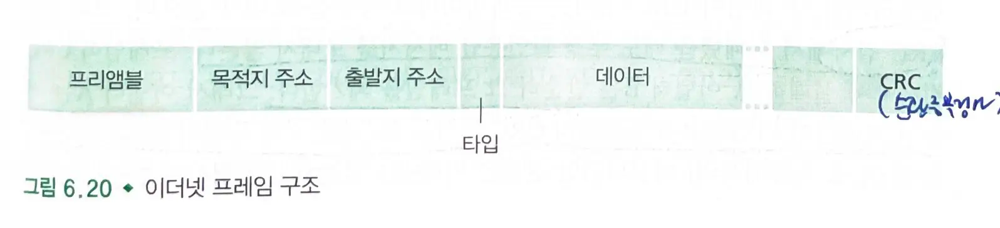
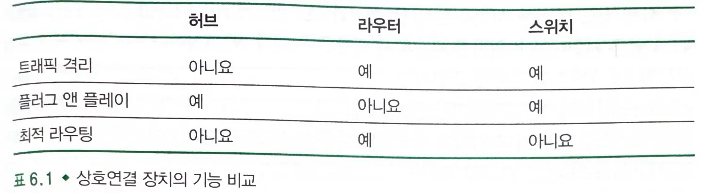
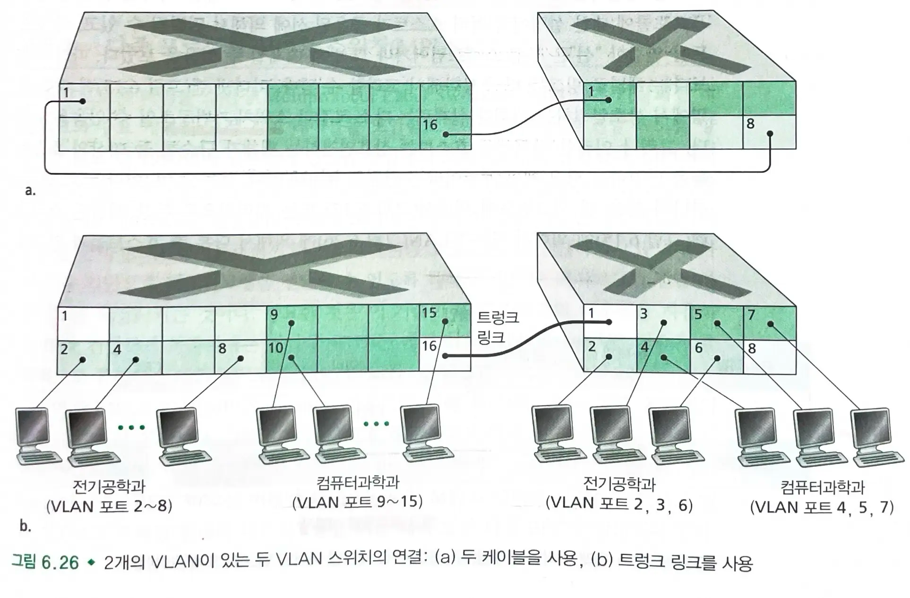

# 6.4 스위치 근거리 네트워크

## 6.4.1 링크 계층 주소체계와 ARP

### MAC 주소

- `호스트나 라우터의 어댑터(네트워크 인터페이스)`는 `링크 계층 주소(MAC 주소)`를 가진다.
    - 다수의 네트워크 인터페이스를 가진 호스트나 라우터는 여러 개의 링크 계층 주소를 갖게 된다.
- **`링크 계층 스위치`는 호스트나 라우터를 연결하는 인터페이스에 `링크 계층 주소`를 할당받지 않는다.**
    - 호스트나 라우터는 중간에 거쳐 가는 링크 계층 주소를 명시하지 않는다.
- 링크 계층 주소 = MAC 주소 = 물리 주소 = 랜 주소
- 길이는 6바이트이며, 2^48 개의 랜 주소가 있으며 16진법으로 표현된다.
    - `IEEE`가 MAC 주소 공간을 관리하여 첫 24비트를 IEEE로부터 구매받고 나머지 24비트는 내부적으로 유일하게 부여한다.
    - MAC 주소는 유일하며 평면 구조(어디에 있던 동일)를 가진다.
- MAC 브로드캐스트 주소는 48개의 1로 되어있는 비트열이다.(FF-FF-FF-FF-FF-FF)

### ARP

- 데이터그램을 전송하기 위해서 출발지 노드는 자신의 어댑터에게 IP 데이터그램 뿐 아니라 MAC 주소도 주어야 한다.
    - **ARP 모듈**은 동일한 서브넷 상의 임의의 `IP 주소`에 대해 대응되는 `MAC 주소`를 돌려준다.
- **ARP 테이블** : IP 주소와 MAC 주소 간의 매핑 정보 및 TTL을 가진다.
    - 일반적인 엔트리 종료 시간은 20분이다.
- **ARP 프로토콜** : ARP 테이블에 목적지 노드에 대한 엔트리가 없을 경우 ARP 프로토콜을 사용한다.
    -
        1. ARP 패킷을 생성한다. (송신 및 수신 IP 주소와 MAC 주소 포함)
    -
        2. ARP 패킷을 브로드캐스팅한다.
    -
        3. ARP 모듈은 자신의 IP 주소가 전달받은 ARP 패킷의 목적지 IP 주소와 일치하면 송신 노드에게 응답 메세지를 보낸다.
    -
        4. ARP 테이블을 갱신한다.
- `응답 ARP 메세지`는 브로드캐스팅되지 않고 표준 프레임으로 전송된다.
    - 다른 노드들은 해당 정보가 필요 없기 때문이다.
- `ARP`는 플러그 앤 플레이로, 노드의 `ARP 테이블`이 자동으로 구축된다.
- ARP는 링크 계층과 네트워크 계층의 경계에 있는 프로토콜이다.

> ARP 모듈은 같은 네트워크 상의 IP 주소와 MAC 주소 매핑을 관리한다.

### 서브넷에 없는 노드로의 데이터그램 전송

- 호스트는 하나의 IP 주소와 하나의 어댑터를 가진다.
- 라우터는 각 인터페이스당 하나의 IP 주소, ARP 모듈(라우터 안)과 어댑터(+MAC 주소)를 가진다.
  
- 예시) 서브넷 1의 호스트 111.111.111.111이 서브넷 2의 호스트 222.222.222.222로 IP 데이터그램을 전송한다고 가정
    - 먼저 데이터그램을 **첫번째 홉 라우터**로 전송해야하므로, 목적지 IP 주소는 그대로 두고 라우터의 IP 주소를 **라우팅 테이블**을 통해 얻어 `ARP`로 MAC 주소를 찾아
      프레임에 `목적지 MAC 주소`로 설정한다.
    - 데이터그램은 목적지에 도달할 때까지 여러 라우터를 거치며 위 과정을 반복한다.
    - 목적지 서브넷의 라우터에 도착하면 ARP를 이용하여 목적지 노드의 MAC 주소로 설정하여 최종적으로 데이터그램을 전달한다.

## 6.4.2 이더넷

- **이더넷은 가장 우세한 랜 기술이다.**
    -
        1. 처음으로 널리 사용된 고속 랜이었다.
    -
        2. 다른 랜 기술은 이더넷보다 복잡하고 비싸다.
    -
        3. 새 기술의 높은 데이터율이 등장할때마다, 대응하는 이더넷이 등장하였다.
    -
        4. 이더넷은 아주 인기가 좋았고 가격이 저렴했다.
- 역사
    - 최소의 이더넷 랜은 동축 버스를 사용하였다.
        - 버스 토폴로지의 이더넷은 브로드캐스트 랜이다.
    - 1990년대 후반에는 랜을 허브 기반의 스타 토폴로지를 사용하는 이더넷으로 교체하였다.
        - 허브: 각 비트에 대한 처리를 하는 물리 계층 장치, 브로드캐스트 랜이다.
    - 2000년대 초반에는 중앙의 허브가 스위치로 대체되었다.
        - 스위치는 2계층까지만 동작한다.
    - 현재 이더넷은 꼬임쌍선이나 광섬유 케이블로 만들어진 점대점 세그먼트를 통해 스위치에 연결된다.

> 모든 것이 변하는 동안 변함없이 그대로 유지된 것 한가지는 이더넷 프레임 형식이다.

- **비연결형 서비스를 제공한다.**
    - 수신 어댑터는 핸드쉐이킹 하지 않고 프레임에 데이터그램을 캡슐화하여 랜으로 전송한다.
- **비신뢰적인 서비스를 제공한다.**
    - CRC 검사에 통과하지 않은 프레임은 폐기하지만 부정 확인응답 메세지를 보내지 않는다.
    - 애플리케이션이 UDP를 사용한다면 데이터 손실이 발생하고, TCP를 사용하면 재전송된다.

### 이더넷 프레임 구조

- `송신 어댑터`는 IP 데이터그램을 이더넷 프레임에 캡슐화하고, 그 프레임을 물리 계층으로 전달한다.
- `수신 어댑터`는 그 프레임을 물리 계층으로부터 받아서 IP 데이터그램을 추출한 후에 네트워크 계층으로 전달한다.
- 필드
    - `데이터 필드`: IP 데이터그램을 운반한다.
        - 최소 크기는 46비트이며, MTU는 1500바이트이다.
    - `목적지 주소`: 목적지 어댑터의 MAC 주소
    - `출발지 주소`: 출발지 어댑터의 MAC 주소
    - `타입 필드`: 네트워크 계층 프로토콜 다중화
    - `순환중복검사(CRC)` : 오류가 생겼는지 검출
    - `프리앰블`: 첫 7바이트는 10101010, 마지막 바이트는 10101011
        - 수신 어댑터를 깨우고 수신자의 클록을 송신자의 클록에 동기화한다.

### 기가비트 인터넷

- 공유되는 `브로드캐스트 채널` 뿐 아니라 `점대점 링크`도 허용한다.
    - 브로드 캐스트 채널의 경우 `허브`를 사용하는 반면에, 점대점 링크에서는 `스위치`를 사용한다.
- 공유되는 브로드캐스트 채널에서는 `CSMA/CD`를 사용한다.
    - 현재 사용하는 `스위치 기반 이더넷 랜`에는 충돌이 없으므로 `MAC 프로토콜`이 필요가 없다.
- 점대점 채널에서는 양방향으로 `40Gps`로 전이중 동작이 가능하다.

## 6.4.3 링크 계층 스위치

- `스위치`: 들어오는 링크 계층 프레임을 수신하여 출력 링크로 전달하는 것
- **스위치는 서브넷의 호스트와 라우터들에게 투명하다.**
    - 호스트/라우터는 프레임을 스위치가 아닌 다른 호스트/라우터를 목적지로 해서 랜상으로 보낸다.
    - 중간에 스위치가 프레임을 받아서 다른 노드에게 전달하는 것을 알지 못한다.

### 전달 및 여과

- **전달**: 프레임이 전송될 인터페이스를 결정하고 프레임을 해당 인터페이스로 내보내는 기능
- **여과**: 프레임을 인터페이스로 전달할지 폐기할지 결정하는 기능
- 스위치 테이블을 통해 `전달`과 `여과`를 결정한다.
    - 스위치 테이블에는 `MAC 주소`, `스위치 인터페이스`, `엔트리가 테이블에 만들어진 시점`이 존재한다.
- 스위치는 IP 주소가 아닌 `MAC 주소`를 기반으로 패킷을 전달한다.
- 기존의 스위치 테이블은 라우팅 테이블과는 전혀 다른 방식으로 구축된다.
- 예시 : 목적지 주소 `DD-DD-DD-DD-DD`를 가진 프레임이 인터페이스 x에 도착
    - **테이블에 해당 주소의 엔트리가 없을 경우**: 스위치는 프레임의 복사본을 인터페이스 x를 제외한 **모든 인터페이스 앞에 있는 출력 버퍼로 전달**한다.
        - 목적지 주소에 대한 엔트리가 없으면, 스위치는 프레임을 **브로드캐스트**한다.
    - **테이블에 해당 주소의 엔트리가 있을 경우**: 프레임을 다른 포트로 보내지 않음으로써 **여과 기능**을 수행한다.
    - **테이블에 `DD-DD-DD-DD-DD`가 인터페이스 `y != x` 와 연관된 엔트리가 있을 경우**: 인터페이스 y 앞에 있는 출력 버퍼에 프레임을 넣음으로써 **전달 기능**을 수행한다.

### 자가 학습

- 스위치는 `자가 학습`을 수행한다.
- 과정
    -
        1. 스위치 테이블은 초기에 비어있다.
    -
        2. 인터페이스로 수신한 각 프레임에 대해 스위치는 출발지 MAC 주소, 도착 인터페이스, 현재 시간을 테이블에 저장한다.
    -
        3. `일정 시간(수명 시간, aging time)`이 지난 후에도 스위치가 해당 주소를 출발지로 하는 프레임을 수신하지 못하면 테이블에서 이 주소를 삭제한다.
- 스위치는 네트워크 관리자나 사용자의 개입을 요구하지 않는 `플러그 앤 플레이` 장치이다.

### 링크 계층 스위치의 특성

- 버스나 허브 기반의 스타 토폴로지와 같은 `브로드캐스트 링크`가 아닌 `스위치`를 사용하면 다음과 같은 장점이 있다.
-
    1. **충돌 제거**: 스위치로 구축된 랜에는 충돌로 인해 낭비되는 대역폭이 없다.

    - 스위치는 프레임을 버퍼링하며 세그먼트에 하나 이상의 프레임을 전송하지 않는다.
    - 스위치의 최대 총 처리율은 모든 스위치 인터페이스 속도의 합이다.
    - 스위치는 브로드캐스트 랜보다 성능이 월등히 높다.
-
    2. **이질적인 링크들**: 각 링크는 상이한 속도로 동작할 수 있고, 상이한 매체를 사용할 수 있다.
-
    3. **관리**: 스위치는 향상된 보안을 제공하며 네트워크 관리를 쉽게 해준다.

### 스위치 대 라우터

#### 라우터

- 네트워크 계층 주소를 사용해서 패킷을 전달하는 저장 후 전달 3계층 패킷 스위치
- 3계층까지 패킷을 처리한다.
- 장점
    - 계층 구조이므로 패킷은 라우터를 따라 순환하지 않는다.
        - 토폴로지는 스패닝 트리로 제한받지 않고 **최상의 경로**를 사용한다.
    - 2계층에서의 브로드캐스트 트래픽 폭주에 대비한 방화벽 기능을 가진다.

> 라우터는 서로 다른 네트워크 세그먼트 간의 브로드캐스트 트래픽을 기본적으로 차단한다.
> 이로 인해 브로드캐스트 폭주가 전체 네트워크로 확산되는 것을 방지한다.

- 단점
    - 플러그 앤 플레이가 아니므로 **설정이 복잡하다.**
    - 3계층 필드까지 처래햐아하므로 스위치보다 **패킷 처리 시간이 상대적으로 길다.**

#### 스위치

- `MAC 주소`를 사용해서 프레임을 전달하는 저장 후 전달 `2계층 패킷 스위치`
- `일치와 동작(match and action, OpenFlow)` 기능을 사용하는 최신 스위치는 목적지 IP 데이터그램을 기반으로 3계층 데이터그램 뿐 아니라 2계층 프레임을 전달한다.
- 장점
    - **플러그 앤 플레이** 장치이다. (설정이 간단하다.)
    - 상대적으로 **높은 패킷 여과 및 전달률**을 가진다. (2계층까지만 패킷을 처리하므로 패킷 처리 시간이 짧다.)
- 단점
    - 브로드캐스트 프레임의 순환을 방지하기 위해 토폴로지는 `스패닝 트리(신장 트리)`로 제한된다.
    - 대규모 스위치 네트워크에서는 호스트와 라우터가 `큰 ARP 테이블`을 갖게 된다.
    - 브로드캐스트 트래픽의 폭주에 대비한 방안을 제공하지 않는다.
- 스위치와 라우터는 상호연결 장치로 사용될 수 있다.
- 스위치의 격리 기능
    - 일반적인 스위치는 기본적으로 같은 브로드캐스트 도메인 내의 트래픽을 격리하지 않는다.
        - **모든 포트가 하나의 브로드캐스트 도메인에 속한다.**
    - 스위치의 트래픽 격리 기능
        - `VLAN` (Virtual Local Area Network):
            - 스위치에서 VLAN을 구성하면 논리적으로 분리된 네트워크를 만들 수 있다.
            - 각 VLAN은 별도의 브로드캐스트 도메인을 형성한다.
            - VLAN 간 트래픽은 기본적으로 격리된다.
        - `포트 기반 VLAN`:
            - 각 포트를 다른 VLAN에 할당하여 트래픽을 분리할 수 있다.
        - `MAC 기반 VLAN`:
            - MAC 주소를 기반으로 VLAN을 할당하여 트래픽을 분리할 수 있다.

#### 언제 스위치를 사용하고 언제 라우터를 사용해야할까?

- **작은 네트워크는 스위치로도 충분하다.**
    - 작은 네트워크는 트래픽이 제한되어 있고 IP 주소의 구성을 요구하지 않으면서도 총처리율을 증가시키므로 스위치로도 충분하다.
- **큰 네트워크는 스위치뿐만 아니라 라우터도 포함된다.**
    - 라우터는 트래픽을 격리시키며 브로드캐스트 트래픽의 폭주를 제어하고, 네트워크 내 호스트들 사이에 좋은 경로를 사용한다.

## 6.4.4 가상 근거리 네트워크 (VLAN)

### 스위치 계층 구조

- 작업그룹(부서)별로 별도의 스위치를 갖고 부서들간의 스위치 랜은 스위치 계층 구조를 이용해서 연결되도록 함
- 단점
    -
        1. 트래픽 격리의 부족

        - 그룹 트래픽은 분리되지만 브로드캐스트 트래픽은 분리할 수 없다.
    -
        2. 스위치의 비효율적인 사용

        - 그룹마다 스위치가 필요하다.
    -
        3. 사용자 관리

        - 사원을 다른 스위치에 연결하기 위해 물리적 케이블 연결을 변경해야 한다.

### 가상 근거리 네트워크(VLAN, Virtual Local Area Network)

- 하나의 물리적 근거리 네트워크 기반 구조상에서 여러 개의 가상 근거리 네트워크들을 정의할 수 있다.
- **`포트 기반 VLAN` : 네트워크 관리자가 스위치 포트(인터페이스)를 그룹으로 나눈다.**
    - 각 그룹은 하나의 VLAN을 구성하며, 한 VLAN의 포트들은 하나의 `브로드캐스트 도메인`을 형성한다.
    - 여러개의 스위치를 하나의 스위치로 대체할 수 있다.
    - 사용자가 그룹을 변경하면 스위치 관리 소프트웨어를 사용하여 포트가 어떤 VLAN에 속하는지 선언한다.
    - `포트 VLAN 매핑 테이블`은 스위치에서 관리되며, 스위치 하드웨어는 **같은 VLAN에 속하는 포트들 간에만 프레임을 전달**한다.
- **다른 그룹에게 메세지를 보낼 수 있도록 구성하는 방법**
    - VLAN 스위치 포트를 외부 라우터에 연결하고 이 포트를 그룹의 VLAN에 모두 속하게 구성하면 된다.
    - 같은 물리 스위치를 공유하더라도 논리적 구성은 라우터를 통해 별도의 스위치를 갖는 것처럼 된다.

- **다른 건물의 포트를 그룹에 추가하는 방법**
    -
        1. 스위치의 포트 하나를 그룹의 `VLAN`에 속하게 하고, 이들 포트를 서로 연결해준다.

        - 스위치의 개수만큼 포트가 필요하므로 확장 문제가 있다.
    - **2. `VLAN 트렁킹` : 스위치마다 하나의 특수 포트가 2개의 VLAN 스위치를 연결하는 트렁크 포트로 구성된다.** `(6-26 b)`
        - 트렁크 포트는 모든 VLAN에 속하며, 한 VLAN에서 전송한 프레임들을 트렁크 링크를 통해 다른 스위치로 전송해준다.
        - `802.1Q` : 프레임이 속한 VLAN을 식별해주는 `4바이트 VLAN 태그`를 헤더에 갖고 있는 표준 이더넷 프레임으로 구성된 `802.1Q 프레임`을 가진다.
            - `VLAN 태그` : 2바이트의 태그 프로토콜 식별자, 2바이트의 태그 제어 정보, 3바이트의 우선 순위 필드로 구성된다.
                - `VLAN 태그`는 VLAN 트렁크의 송신 측에 있는 스위치에 의해서 프레임에 추가된다.
            - 트렁크의 수신 측에 있는 스위치에 의해서 파싱되고 제거된다.
- `MAC 기반 VLAN` : 네트워크 관리자가 VLAN에 속하는 `MAC 주소`들을 명시한다.

