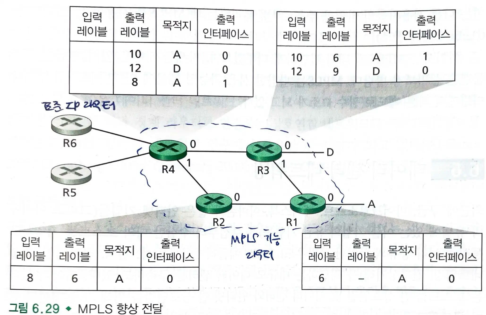

# 6.5 링크 가상화 - 링크 계층으로서의 네트워크

- 링크: 서로 통신하는 2개의 호스트를 연결하는 물리적인 선
  - 이더넷 랜에서 상호 연결 매체가 실제로는 스위치 기반구조일 수 있다.
  - 다이얼업 모뎀 연결에서 연결 링크는 전화 네트워크이다.

## 6.5.1 다중 프로토콜 레이블 스위칭(MPLS)

- 회선 교환 전화 네트워크와 달리, `가상 회선 네트워크`이다.
  - 물리적인 회선 대신 '가상 회선'을 사용하여 데이터 패킷에 라벨을 붙여 미리 정의된 경로(가상 회선)를 따라 전송한다.
  - 실제 물리적 연결은 여러 사용자가 공유하지만, 각 데이터 흐름은 마치 전용 회선을 사용하는 것처럼 처리된다.
- `고정 길이 레이블`과 `가상 회선`을 기반으로 데이터그램을 전달한다.
  - `고정 길이 레이블`을 도입함으로써 IP 라우터의 전달 속도를 향상시킨다.
- `목적지 기반 IP 데이터그램`의 하부 구조를 확장한다.
  - 가능한 경우에 데이터그램을 선택적으로 레이블링해서 라우터로 하여금 `고정 길이 레이블`을 기반으로 데이터그램을 전달할 수 있도록 한다.

### MPLS 헤더, 라우터

- `MPLS 헤더`: 2계층(링크 계층, 이더넷)과 3계층(네트워크 계층, IP) 헤더 사이에 작은 MPLS 헤더를 가진다.
- MPLS 향상 프레임은 `MPLS 가능 라우터`들 사이에서만 전송될 수 있다.
  - `MPLS 가능 라우터`는 `MPLS 레이블`을 포워딩 테이블에서 찾아 적당한 출력 인터페이스로 데이터그램을 전달한다.
  - MPLS 가능 라우터는 목적지 IP 주소를 꺼낼 필요도 없고, 포워딩 테이블에서 최장 prefix 대응을 찾을 필요도 없다.

### MPLS 가능 라우터 간 상호 동작

- IP 장치 R5, R6, A, D가 MPLS 기반 구조를 통해 서로 연결된다.
  - MPLS 가능 라우터인 R1부터 R4는 패킷의 IP 헤더를 건드리지 않고 동작한다.
- **트래픽 엔지니어링(트래픽 관리 기능)** 은 MPLS가 제공하는 가장 큰 장점이다.
  - 라우터 R4는 A에 도달할 수 있는 2개의 경로를 갖는다.
  - IP 라우팅 프로토콜은 A로의 최소비용경로 하나만을 지정하는 것과 달리, MPLS는 여러 경로를 통해 패킷을 전달할 수 있다.
- MPLS는 **MPLS 전달 경로의 빠른 복구**를 위해 사용된다.
  - 링크 고장시 미리 계산된 복구 경로로 트래픽을 재배정한다.
- MPLS는 **가상 사설 네트워크(VPN)** 을 구현하는데 사용될 수 있다.

