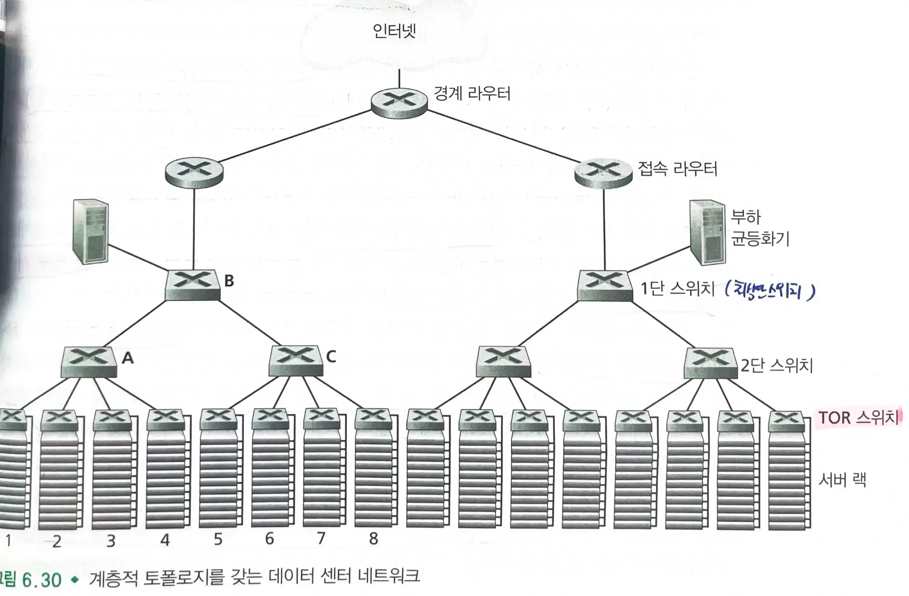
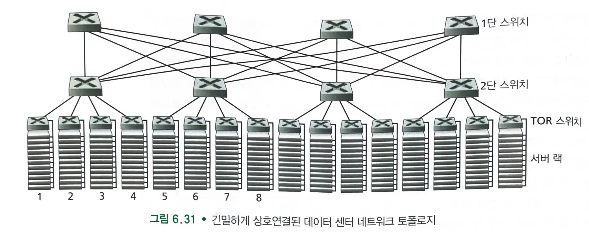

# 6.6 데이터 센터 네트워킹

- 대규모 데이터 센터에 소요되는 비용은 매우 크다.
  - 45% 호스트에 드는 비용, 25% 기반 구조, 발전기, 냉각 비용, 15% 네트워크 장비 비용

### 데이터 센터의 호스트

- 호스트는 `blade(블레이드)`라고 불리며 CPU, 메모리, 디스크 저장장치를 가진다.
- 데이터 센터의 호스트들은 20~40대의 블레이드를 적재할 수 있는 `랙(rack)`에 적재된다.
- 랙의 맨 위에는 `TOR 스위치`가 있으며, TOR 스위치는 랙에 있는 호스트들을 연결해주고 데이터센터의 다른 스위치들과 연결된다.
  - TOR 스위치와 랙에 있는 호스트는 네트워크 인터페이스 카드를 통해 연결된다.
- `외부 클라이언트와 내부 호스트 사이의 트래픽`과, `내부 호스트 간의 트래픽`을 지원한다.
  - 외부 클라이언트와 내부 호스트 사이의 트래픽을 지원하기 위해 하나 이상의 `경계 라우터`를 가진다.
- `데이터 센터 네트워크`는 랙을 서로 연결해주고 랙을 `경계 라우터`에 연결한다.

## 부하 균등화

- 외부 클라이언트로부터의 요청을 지원하기 위해서 애플리케이션에는 `공용 IP 주소`가 할당된다.
  - 클라이언트는 이 IP 주소로 요청을 보내고 응답을 받는다.
- 데이터 센터에서는 외부로부터 요청이 들어오면 `부하 균등화기`로 보내며, `부하 균등화기`는 요청을 호스트로 분배하여 호스트간의 부하를 균등하게 한다.
  - 부하 균등화기는 패킷의 `IP 주소(3계층)` 뿐 아니라 `목적지 포트 번호(4계층)`를 보고 결정하므로 `4계층 스위치`라고도 한다.
  - 부하 균등화기는 `NAT`와 유사한 기능(공용 외부 IP 주소 <->내부 IP 주소)을 제공하여 보안을 제공한다.

## 계층적 구조

- 소규모 데이터 센터는 경계 라우터 1대, 부하 균등화기 1대, 단일 이더넷 스위치만으로도 모두 연결 가능한 수십개의 랙을 가진 네트워크로도 충분하다.
- 수십만대의 호스트로 확장하기 위해서, **라우터와 스위치의 계층구조**를 채택한다.
  - **경계 라우터**가 접속 라우터들에 연결된다.
  - **접속 라우터** 아래에는 세 단의 스위치가 있다.
    - 접속 라우터는 **최상단 스위치**에 연결되고, 최상단 스위치는 여러 개의 **두번째 단 스위치**들과 부하 균등화기에 연결된다.
    - 두번째 단 스위치는 랙의 **TOR 스위치**를 통해 여러 랙으로 연결된다.
- 클라우드 애플리케이션 제공자는 데이터 센터 설계에 여분의 네트워크 장비와 링크를 포함한다.
  - 이를 통해 애플리케이션의 가용성을 높인다.
- `접속 라우터` 밑의 호스트들은 **하나의 서브넷**을 형성한다.
  - ARP 브로드캐스트 트래픽을 지역 내로 한정시키기 위해 작은 `VLAN 서브넷`들로 분할된다.
- 호스트 간에 대용량 통신이 가능하게 해주어야한다.
  - 데이터 센터 네트워크에 동시에 여러개의 플로우가 있는 경우 다른 랙에 있는 두 호스트간 최대 전송률은 훨씬 작아진다.

## 데이터 센터 네트워킹 동향

-
  1. **완전 연결 토폴로지**를 이용해 스위치와 라우터의 계층구조를 대체한다.

  - 하나의 1단 스위치가 모든 2단 스위치에 연결된다.
  - 호스트-호스트 용량을 증가시킬 수 있다.
  - 스위치간 라우팅 알고리즘 설계시 랜덤 라우팅이나 호스트마다 네트워크 인터페이스를 여러개 설치하여 여러개의 저가 스위치에 연결하여 라우팅을 수행하는 방법이 있다.
-
  2. **선박 컨테이너 기반의 모듈화된 데이터 센터(MDC)** 도 있다.

  - 각 컨테이너의 내부 네트워크와 컨테이너들을 연결하는 중앙 네트워크가 있다.
  - -성능이 저하된 컨테이너부터 순차적으로 교체하거나 업그레이드할 수 있다.
-
  3. 대규모 클라우드 제공자가 네트워크 어댑터, 스위치, 라우터, TOR, 소프트웨어, 네트워킹 프로토콜 등 데이터 센터에 있는 **모든 것들을 구축하거나 커스터마이징**한다.
-
  4. 근처 건물들에 **데이터 센터를 복제**함으로서 고장 내구성을 제공한다.

  - 동일 가용 구역에 있는 데이터 센터들 간의 트랜잭션 데이터를 동기화할 수 있다.
  - ex) 아마존

