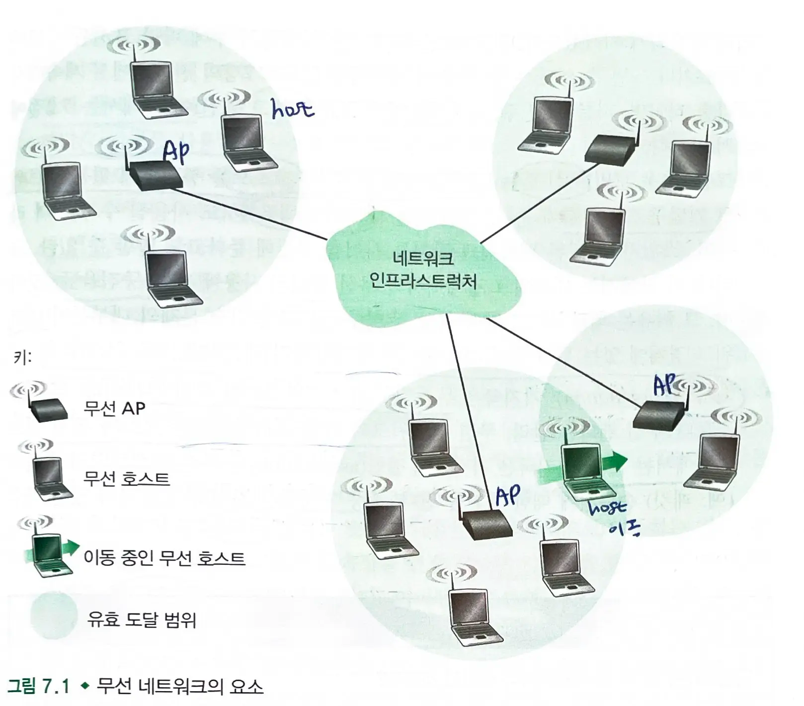
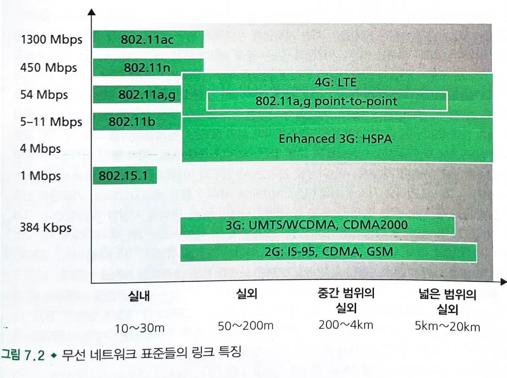

# 7.1 개요

## 무선 네트워크 구성요소

### 무선 호스트

- 애플리케이션이 실행하는 종단 시스템 장치
- 이동성을 가질 수도 있고 가지지 않을 수도 있다.

### 무선 랜

- 호스트는 `무선 통신 링크`를 통해 `기지국`이나 다른 `무선 호스트`에 연결된다.
  - 무선 랜을 통해 네트워크 경계에 있는 호스트를 중심부에 있는 네트워크 기반 구조로 연결해준다.

### 기지국

- 기지국에 결합된 무선 호스트와의 데이터 송수신에 대한 책임을 진다.
- 셀룰러 네트워크의 `셀 타워`와 무선 네트워크에서의 `AP`가 기지국에 해당한다.
- 기지국은 더 큰 네트워크에 연결되며, `무선 호스트`와 `나머지 네트워크` 부분과의 `링크 계층 중계 기능`을 제공한다.
- 기지국에 접속된 호스트는 `인프라스트럭처` 방식으로 동작한다.
  - 기지국을 통해서 호스트가 연결되어 있는 네트워크가 기존의 모든 네트워크 서비스를 제공한다.
- 반면에, `애드 혹 네트워크`는 무선 호스트는 연결할 수 없는 기반 구조가 없다.
  - 기반구조 없이 스스로 라우팅, 주소 할당, DNS와 같은 이름-주소 변환을 수행해야 한다.
- `핸드오프`: 호스트가 한 기지국 영역을 벗어나 다른 기지국 영역으로 이동하는 것

### 네트워크 기반 구조

- 무선 호스트가 통신하고자 하는 큰 네트워크

## 무선 네트워크 구분

- 하나의 홉만을 거치는지, 여러 홉을 거치는지
- 네트워크 기반 구조를 가지는지

### 단일 홉, 기반구조 존재

- 인터넷과 같이 보다 큰 유선 네트워크와 연결된 기지국을 가진다.
- 모든 통신은 단일 무선 홉으로 이루어진다.
- 802.11 네트워크나 4G 무선 데이터 네트워크

### 단일 홉, 기반구조  X

- 유선 네트워크와 연결된 기지국이 없다.
  - 단일 홉 네트워크안의 `하나의 노드`가 다른 노드들의 전송을 중재, 조정할 수 있다.
- 블루투스 네트워크, ad hoc 네트워크

### 다중 홉, 기반구조 존재

- 보다 큰 네트워크에 연결된 기지국이 존재한다.
- 일부 노드들은 기지국과 통신하기 위해 다른 무선 노드들의 중계를 거쳐야 한다.
- 일부 `무선 센서 네트워크`와 `무선 메시 네트워크`

### 다중 홉, 기반구조 X

- 기지국이 없으며 노드들은 목적지에 메세지를 보내기 위해 여러 노드들의 중계를 거친다.
- `이동 애드 혹 네트워크` : 노드들은 이동성이 있어 노드들 간의 연결성이 변화할 수 있다.
  - 이동 노드가 차량이라면 `차량 애드 혹 네트워크`라고 한다.

