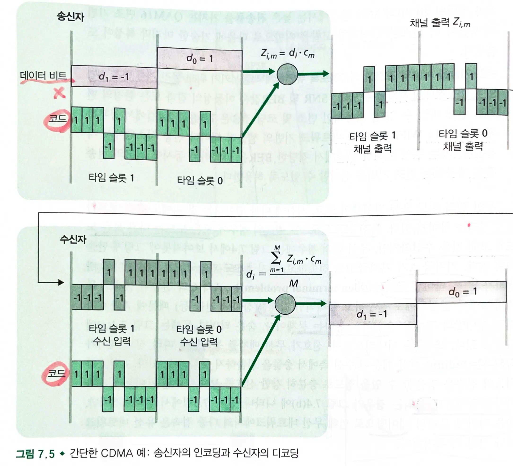

# 7.2 무선 랜과 네트워크 특징

## 유선 링크와 무선 랜간의 차이점

- 신호 세기의 감소
    - 경로 손실 : 전자기파는 물체를 통과함에 따라 약화된다.
        - 거리가 증가함에 따라 신호의 세기가 감소한다.
- 다른 출발지로부터의 간섭 : 동일 주파수 대역으로 전송되는 무선 신호들은 서로 간섭히게 된다.
- 다중 경로 전파: 송신자와 수신자 간에 전송되는 전자기파의 일부가 물체나 지표에 부딪혀서 서로 길이가 다른 여러 개의 경로를 거쳐 간다.
- 유선 링크보다는 무선 랜에서 비트 오류가 더 잘 생길 수 있다.
    - 강력한 CRC 오류 검출 코드를 사용할 뿐 아니라, 링크 수준의 신뢰성 있는 데이터 전송 프로토콜을 사용한다.

### 비트 오류

- `SNR` : 측정된 수신 신호의 세기와 잡음의 상대적인 비율
    - 데시벨 단위 사용
- `BER` : 비트 오류율
    - 송신된 비트가 수신 측에서 오류로 검출될 확률
- 동일한 변조 기법 내에서는 `SNR` 값이 높을 수록 `BER` 값은 낮아진다.
- 동일한 `SNR` 값에서는 `높은 전송률`을 가지는 변조 기법이 더 높은 `BER` 값을 갖는다.
- 변조 기술을 채널의 조건에 적합하도록 유연하게 적응시키기 위해 물리 계층 변조 기법의 동적인 선택이 사용된다.

### 숨은 터미널 문제와 페이딩

- `숨은 터미널 문제` : 서로 통신 범위 밖에 있는 두 노드가 동시에 중간에 있는 노드와 통신하려 할 때 발생하는 충돌 문제
    - 중간 노드에서 신호 충돌이 발생하여 데이터 손실이 일어난다.
- `페이딩` : 전자기파가 전파될 때 신호 강도가 감소하거나 변동하는 현상
    - 신호가 무선 매체를 통과함에 따라 신호 세기가 약해지는 현상

## 7.2.1 CDMA (코드 분할 다중 접속)

- 송신자가 전송하는 각 비트를 확장해 원래 데이터 비트열보다 훨씬 빠른 속도로 변하는 신호를 곱하는 방식으로 인코딩한다.
- 송신자의 코드를 주의깊게 선택한다면, 다수 송신자로부터의 합쳐진 신호로부터 원하는 송신자가 전송한 데이터를 쉽게 추출할 수 있다.

