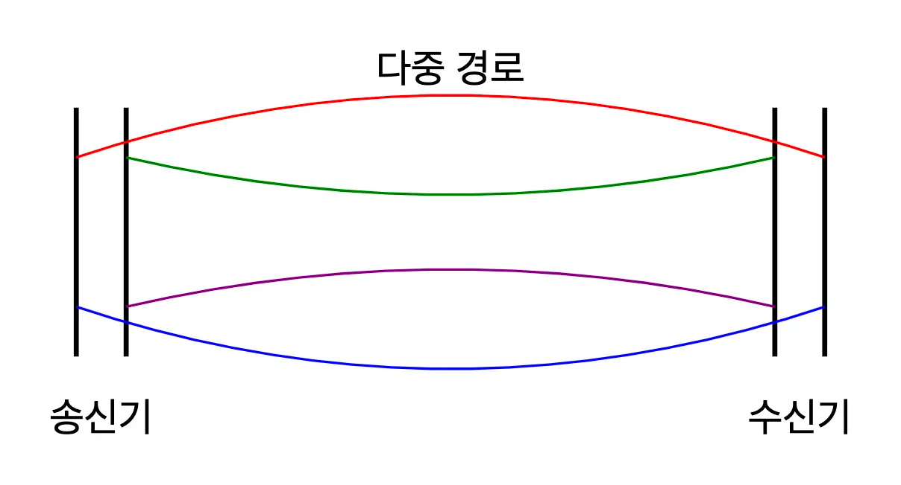
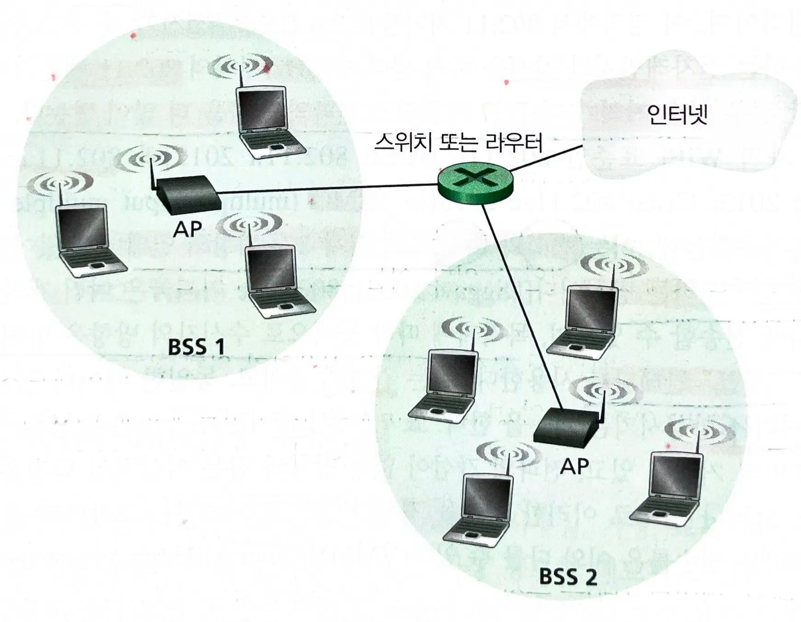
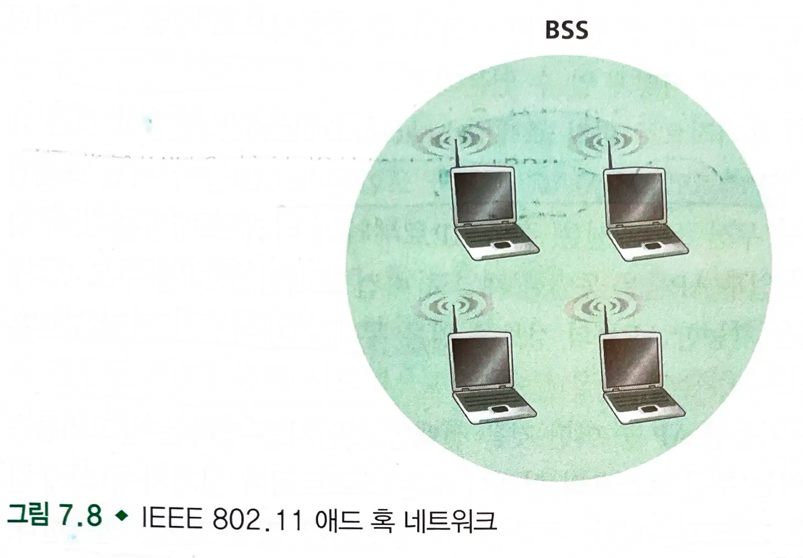
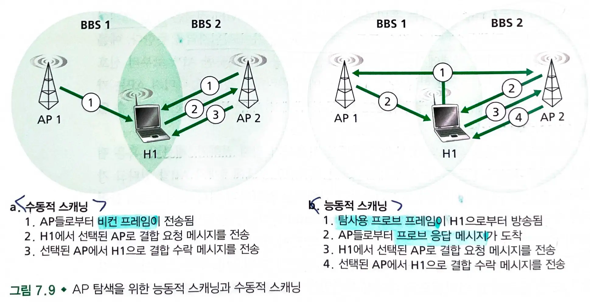
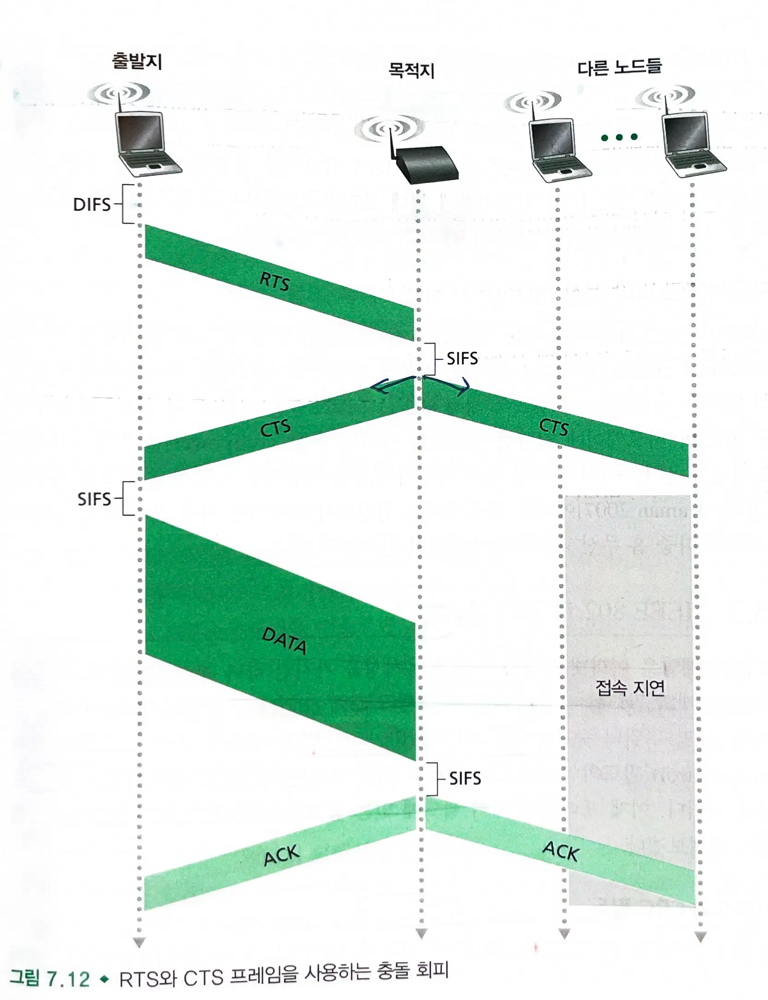
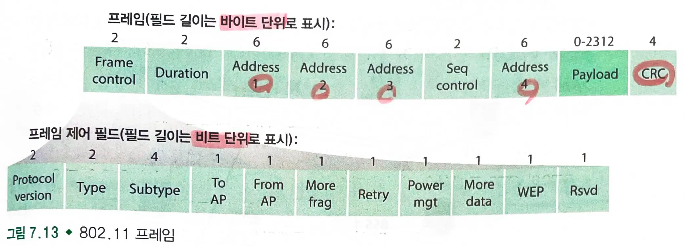

# 7.3 WiFi : 802.11 무선 랜

- 가장 성공적인 무선 랜 표준은 WiFi라고 알려진 IEEE 802.11 무선 랜이다.
  - 모두 `CSMA/CD` 라는 동일한 매체 접속 프로토콜을 사용한다.
  - 동일한 링크 계층 프레임 구조를 사용한다.
  - 이전 표준기술과의 호환성을 가진다.

### 물리 계층의 2종류 주파수를 가진다

- `2.4GHz` 대역의 주파수 영역
- `5 GHz` 대역의 주파수 영역
  - 802.11은 전력 수준이 동일할 경우 전송 거리가 더 짧고 다중경로 전파의 영향을 더 많이 받는다.

- 가장 최신의 wifi 표준인 802.11n과 802.11ac는 MIMO 안테나와 스마트 안테나를 사용한다.
  - 스마트 안테나 : 목적지에 따라 동적으로 **수신자의 방향을 향해 전송**
    - 이를 통해 간섭을 줄이고 신호 강도를 향상시킨다.
  - MIMO 안테나 : 송신과 수신측에 각각 2개 이상의 안테나를 가져 서로 다른 신호를 송수신한다.
    - 수신단에서는 복잡한 알고리즘을 사용하여 여러 경로로 수신된 신호를 분리하고 해석한다.
    - 이를 통해 간섭을 줄이고 신호 품질을 향상시킨다.

## 7.3.1 802.11 구조

- 802.11 구조의 기본 단위는 `BSS`이다.
  - BSS는 하나 이상의 무선 스테이션과 하나의 중앙 기지국(AP)로 구성된다.
  - 무선 기지국은 6바이트의 MAC 주소를 가지며 어댑터 펌웨어에 저장되어 있다.
- AP를 가진 무선 랜을 `인프라스트럭처 무선 랜`이라고 한다.
- 반면, 애드혹 네트워크일 경우 네트워크는 즉석에서 생성되며, AP의 도움 없이 데이터를 교환한다.

### 채널과 결합

- AP 설치시 하나 또는 두 워드의 SSID와 채널 번호를 할당한다.
  - 2개의 채널은 4개 이상의 채널에 의해 분리되어 있어야 겹치지 않는다.
- Wifi 정글 : 무선 스테이션이 둘 이상의 AP로부터 강한 신호를 받는 모든 지역
  - 무선 스테이션은 단 하나의 AP와 결합(가상 회선 만들기)되어야 한다.

#### 수동적 스캐닝

- AP는 주기적으로 비컨 프레임(SSID와 MAC 주소)을 보낸다
  - 일반적으로 무선 호스트는 비컨 시그널의 세기가 가장 강한 AP를 선택한다.

#### 능동적 스캐닝

- 무선 호스트가 영역 안에 있는 AP 들에게 `탐사용 프로브 프레임`을 방송한다.
- 영역 내에 있는 AP들이 프로브 요청에 대해 `프로브 응답 메세지`를 보내면, 무선 호스트는 이들 AP 중 하나를 선택할 수 있다.
- AP를 선택한 후 무선 호스트는 해당 AP에게 결합 요청 메세지를 보내고, AP는 결합 수락 메세지를 반송한다.
- 그 후 무선 호스트는 AP가 속한 서브넷의 IP 주소를 얻기 위해 `DHCP 발견 메세지`를 전송한다.
  - AP는 연결된 `라우터`의 DHCP 서버에게 전달하고 NAT 기능을 수행한다.
  - 무선 호스트는 서브넷의 내부 IP 주소를 가진 한 노드가 된다.

### 인증

- 무선 스테이션이 특정 AP와 결합하기 위해 인증시켜야할 때도 있다.
  - 스테이션의 MAC 주소를 기반으로 접근을 허용하는 방법
  - 사용자 이름과 암호를 이용하는 방법

## 7.3.2 802.11 MAC 프로토콜

- 802.11 설계자들은 랜덤 접속 프로토콜 CSMA/CA를 사용한다.
  - 스테이션이 전송하기 전에 채널 상태를 감지하고, 채널이 사용중이면 전송하지 않는다.

#### CSMA/CA

- `충돌 검출`을 사용하지 않고 `충돌 회피`를 사용한다.
  - 스테이션이 프레임을 전송하기 시작하면 멈추지 않는다.
  - 스테이션은 채널이 사용되지 않으면 `DIFS` 시간을 기다린 후 프레임을 전송한다.
  - 채널이 사용중이면 임의의 시간을 대기한다.
- 무선 채널의 비트 오류율이 크므로 링크 계층 ARQ 방식을 사용한다.
  - 목적지 기지국은 CRC 검사를 통과한 프레임을 수신하면 `SIFS` 시간을 기다린 후 ACK 프레임을 송신자에게 보낸다.
  - ACK를 수신하지 못하면 더 증가된 임의의 시간값을 선택한다.

### 숨은 터미널 해결 방안: RTS와 CTS

- 무선 스테이션은 AP로부터는 잘 보이지만 그들 서로 간에는 숨어 있다.
- 스테이션들이 `RTS`와 `CTS`를 주고받음으로써 채널 접근을 예약할 수 있게 해준다.
  -
    1. 송신자는 RTS를 AP에게 보냄으로써 전송시간을 알려준다.
  -
    2. AP는 CTS를 브로드캐스팅하여 예약을 알린다.
- 충돌없이 전송되고 숨은 스테이션 문제가 완화된다.

## 7.3.3 IEEE 802.11 프레임

- Address 2: 프레임을 전송하는 스테이션의 MAC 주소
- Address 1:  프레임을 수신하는 스테이션의 MAC 주소
- Address 3: 라우터 인터페이스의 MAC 주소
  - BSS는 서브넷의 일부이고, 라우터 인터페이스를 통해 다른 서브넷과 연결된다.
  - 이더넷 프레임이 AP에 도착하면 무선 채널로 전송하기 전에 802.3 이더넷 프레임을 802.11 프레임으로 변환한다. (그 반대도 수행)

### 순서 번호

- 순서번호를 사용함으로써 수신자는 새로 전송된 프레임과 재전송된 프레임을 구분할 수 있다.
- Duration : 채널 예약 시간
- Frame Control : 여러개의 서브 필드로 구성

## 7.3.4 동일한 IP 서브넷 내에서의 이동성

- 동일한 IP 서브넷에 여러개의 BSS를 설치하기도 한다.
- BSS간 이동성 문제가 발생한다.
  - 호스트의 IP 주소는 유지되며, 모든 TCP 연결도 유지될 수 있다.
- 호스트는 AP를 떠나면서 더 강한 신호를 찾기 시작한다.
- 새로운 AP의 비컨 프레임을 수신하면 새로운 결합을 만든다.
- 이동한 호스트는 출발지를 자신으로 한 이더넷 프레임을 브로드캐스팅함으로써 스위치의 포워딩 테이블을 갱신한다.

## 7.3.5 802.11의 진전된 특징

### 전송률 적응

- 채널 상황에 맞추어 물리 계층 변조 기법을 선택할 수 있다.
  - 조건이 좋은 상황이면 사건이 발생하기 전까지 전송률을 높인다.
  - 사건이 발생하면 전송률을 낮춘다.

### 전력 제어

- 노드는 명시적으로 휴면 상태와 동작 상태를 오가며 상태를 변화시킨다.
  - 전력 제어 비트를 1로 설정하여 수면 모드로 도입될 것을 알린다.
- AP는 수면 상태의 호스트에게 전송될 프레임을 버퍼링한다.
- AP로부터 비컨 신호가 전송하기 직전에 깨어난 노드는 비컨 신호 안에 버퍼링 목록 상에 자신이 없다면 다시 수면 모드로 돌아간다.
- 에너지 절약 효과를 얻을 수 있다.

## 7.3.6 PAN : 블루투스와 지그비

### 블루투스

- 2.4GHz의 비허가 무선 대역에서 TDM 방식으로 동작한다.
- `주파수 홉핑 방식`(FHSS)
  - 송신자는 시간 슬롯마다 79 채널 중에 한 채널로 전송하며, 의사 무작위 추출 방식이다.
- `애드 혹 네트워크`이며, 스스로 연결을 형성해야 한다.
  - 처음에 최대 8개의 활성 노드로 피코넷을 형성한다.
  - 마스터와 슬레이브로 구성되며, 마스터의 클록에 의해 내부 시간이 결정된다.
  - 마스터는 홀수 번째 슬롯마다 전송할 수 있고, 슬레이브는 이전 슬롯에서 마스터가 슬레이브와 통신한 다음에 마스터에게 전송할 수 있다.

### 지그비

- 블루투스보다 더 저전력, 저속, 저사용률을 갖는 응용분야에 적합하다.
- `FFD`와 FFD의 제어를 받는 `RFD`로 구성된다.
  - 여러개의 FFD들이 서로 간의 메시 형태 네트워크를 구성하고 프레임을 전송할 수 있다.
