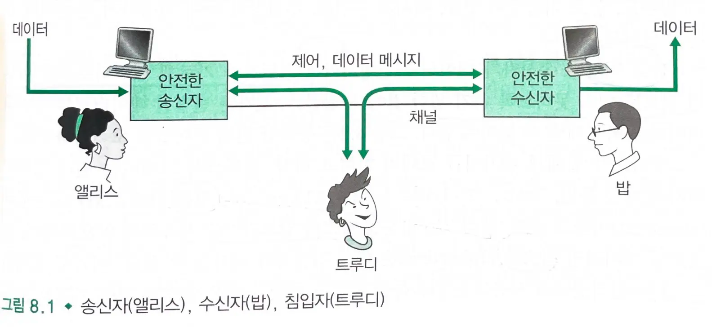

# 8.1 네트워크 보안이란 무엇인가?

## 안전한 통신에 요구되는 특성

### 기밀성

- 송신자와 지정된 수신자만이 전송되는 메세지 내용을 이해할 수 있어야 한다.
  - 도청자가 해석할 수 없도록 **암호화**해야 한다.

### 메세지 무결성

- 전송 도중에 변경되지 않아야 한다.
  - **체크섬** 기술을 확장하여 메세지 무결성을 제공한다.

### 종단점 인증

- 송신자와 수신자간의 서로의 신원을 확인할 수 있어야 한다.

### 운영 보안

- 공공 인터넷에 연결되어 잠재적인 위험을 가지는데, 이를 막기 위해 방화벽이나 침입 감지 시스템을 설치한다.
  - **방화벽** : 기관의 네트워크와 공공 네트워크 사이에 설치되어 두 네트워크 사이를 오가는 패킷들을 제어한다.
  - **침입 감지 시스템**: 패킷을 상세히 관찰하고 의심스러운 행위에 대해 네트워크 관리자에게 보고한다.

## 침입자가 할 수 있는 일

- **엿듣기** : 채널상의 제어 메세지 및 데이터 메세지를 엿듣거나 기록
- 메세지 혹은 메세지 내용의 **조작**, **삽입** 혹은 **삭제**

### 안전한 데이터 교환

- `제어 메세지`와 `데이터 메세지`를 교환하며 기밀성, 인증, 메세지 무결성 요구사항을 충족시킨다.

