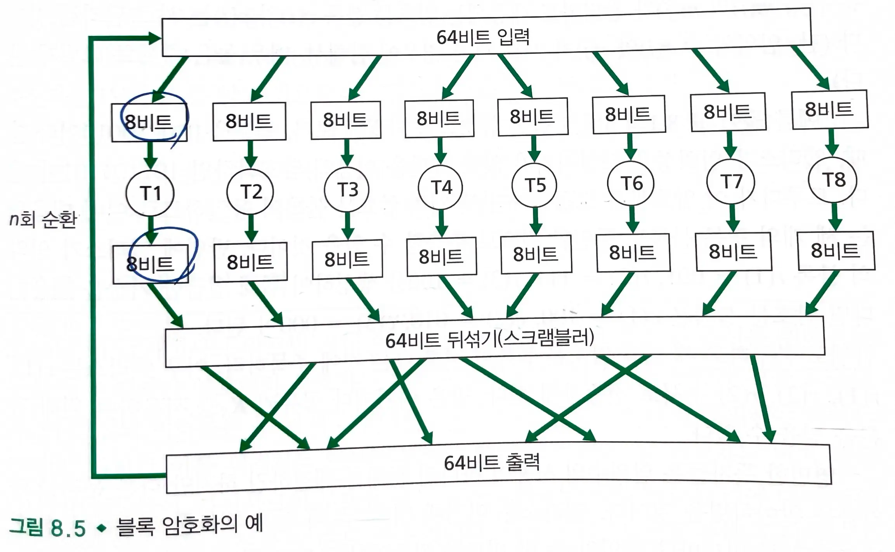
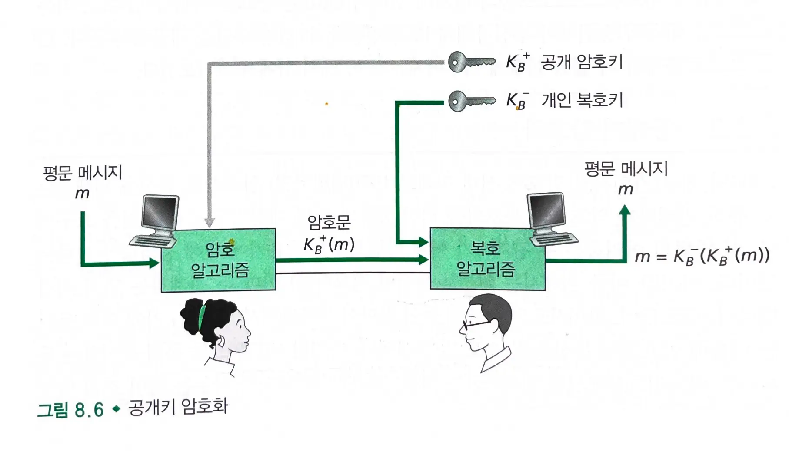
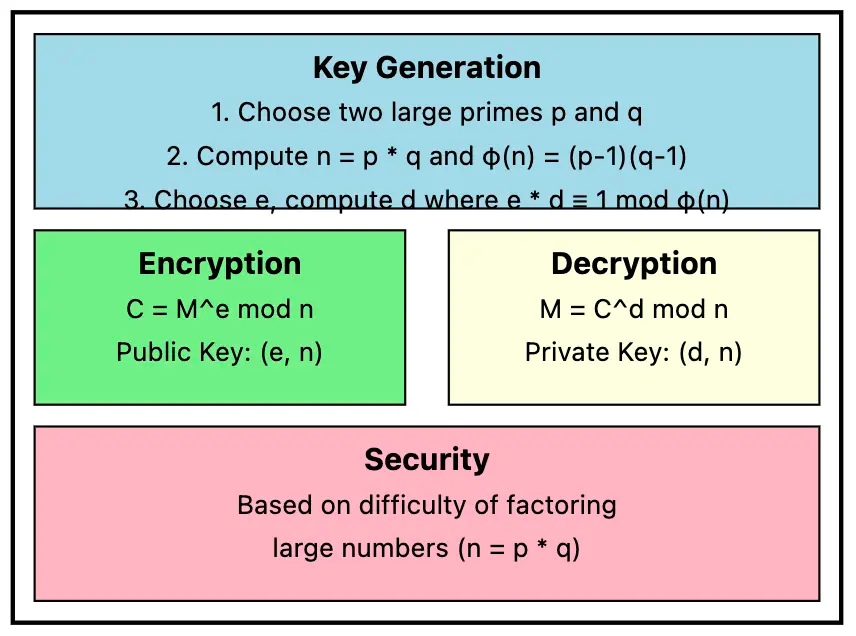

# 8.2 암호의 원리

### 암호 기술

- 송신자가 데이터를 변경시켜서 침입자가 가로챈 데이터로부터 아무런 정보도 얻지 못하도록 하기 위한 것
- `평문` 또는 `원문`을 암호화 알고리즘을 사용해서 암호화하여 암호문을 생성한다.
  - 현대의 많은 암호화 알고리즘은 알려져 있기 때문에, 암호문의 평문을 알아내지 못하게 하기 위해 키가 필요하다.
- **복호** 알고리즘: 암호문을 복호화하여 평문을 만들어낸다.
- 키 시스템
  - **대칭키 시스템** : 두 종단 시스템의 사용자가 가진 키가 동일하다
  - **공개키 시스템**: 한 쌍의 키가 사용되며, 한 키는 공개키이고 나머지 하나는 비밀키이다.

## 8.2.1 대칭키 암호화

### 카이사르 암호

- 평문의 각 철자를 알파벳 순서로 K번째 뒤로 오는 철자로 대치한다.
- 25가지의 키만이 가능하다.

### 단일 문자 대응 암호

- 카이사르 암호를 개선한 것
- 각 철자들은 고유한 대응 글자로 변환된다.
- 26!만큼의 문자 대응쌍이 가능하다.
- 통계 분석을 통해 암호를 해독할 수 있다.
  - e와 t가 일반 영어 문장에서 가장 흔하게 나타난다.

#### 암호 기법 해독 난이도

- **암호문만을 이용한 공격** : 암호문만 가지고 있는 경우이다.
  - 통계 분석을 통해 해독될 수 있다.
- **알려진 평문 공격**: 침입자가 어느 정도 평문과 암호문의 쌍을 알고 있는 경우이다.
- **선택 평문 공격** : 침입자가 특정 평문 메세지를 선택하여 이에 대응하는 암호문을 얻는 경우이다.

### 다중 문자 대응 암호화

- 단일 문자 대응법을 가지고 **평문 메세지에서의 위치**에 따라 `서로 다른 단일 문자 대응 암호법을 사용`한다.
- 몇개의 카이사르 키와 반복되는 패턴을 가지고 해독을 시도할 수 있다.

- 오늘날 대칭키 암호화 기술은 크게 스트림 암호화 블록 암호로 나뉜다.
  - 스트림 암호화는 이후에 알아보자.

### 블록 암호화

- 메세지를 k비트의 블록 단위로 암호화한다.
  - k비트 블록의 평문을 k비트 블록의 암호문으로 대응시킨다.
  - 사상표에 따라 암호화된다.
- k는 64비트 혹은 그보다 큰 블록을 사용한다.
- 구현이 어렵다.
  - k=64라면 2^64개의 입력 블록에 대한 테이블을 유지해야하는데, 이는 실행이 거의 불가능하다.

#### 비트 뒤섞기

- k=64일때, 64 비트 블록을 8비트씩 `8개의 청크`로 나눈다.
- 각 청크가 암호화된 후 출력 청크들은 하나의 64비트 블록으로 합쳐진다.
- 블록 내 64비트 각각의 위치는 뒤섞여 하나의 64비트 출력을 만들어 낸다.
- 사이클을 n번 반복하고 나면 최종적인 64비트 암호문 블록이 생성된다.

#### 오늘날 사용되는 블록 암호화 방법

- `DES`, `3DES`, `AES` 등이 있다.
- 각 표준들은 화살표에 대응되는 함수를 사용한다.
- 각 알고리즘들은 비트열을 키로 사용한다.
  - DES는 56비트의 키를 64비트 블록과 함께 사용한다.
  - 알고리즘의 키는 알고리즘 내부에서 특정 미니 테이블의 사상과 순열을 결정한다.

### 암호 블록 체이닝

- **평문 블록이 동일하더라도 서로 다른 암호문 블록이 생성**될 수 있어야 한다.
  - 이를 위해 **임의성**(randomness)을 추가한다.
- 첫번째 메세지와 함께 `임의의 수(랜덤값)`을 단 한번만 전송하고 이후의 임의의 수로는 직전에 계산된 암호문 블록을 대신 사용한다.
  -
    1. 메세지를 암호화하기 전에 송신자는 `초기화 벡터(c(0))`를 생성하여 수신자에게 보낸다.
  -
    2. 송신자는 `Ks(m(1) xor c(0))`을 계산하여 수신자에게 전송한다.
  -
    3. i번째 블록에 대해 송신자는 `c(i) = Ks(m(i) xor c(i-1))`을 이용하여 i번째 암호문 블록을 생성한다.

## 8.2.2 공개키 암호화

### Diffie Hellman

- 공개키를 미리 공유하지 않고 암호화 통신을 수행하는 방법
- 암호화와 인증 및 전자서명을 수행할 수 있다.
- 수신자는 공개키와 개인키를 가진다.
  - 공개키는 모두에게 공개되어 있고, 개인키는 본인만 알 수 있다.
- 송신자는 수신자에게 보낼 메세지를 수신자의 공개키로 암호화하여 전송한다.
- 수신자는 수신자의 개인키로 암호문을 복호화한다.
- 위험성
  - 침입자는 적절한 메세지를 생성하여 수신자의 공개키로 암호화하는 선택 평문 공격을 수행할 수 있다.
  - 침입자는 수신자를 사칭하여 메세지를 보낼 수 있다.

### RSA

- `modulo-n` 연산을 많이 사용한다.
- 공개키와 개인키를 선택한다.
  - a) 두 개의 큰 소수 p와 q를 선택한다.
  - b) n = p * q를 계산한다.
  - c) φ(n) = (p-1)(q-1)를 계산한다.
  - d) 1 < e < φ(n)이며 φ(n)과 서로소인 정수 e를 선택한다. 공개 지수이다.
  - e) d * e ≡ 1 (mod φ(n))을 만족하는 d를 계산한다. 개인 지수이다.
- 공개키와 개인키
  - 공개키: (n, e)
  - 개인키: (n, d)
- 암호화
  - 평문 M에 대해, 암호문 `C = M^e mod n`
- 복호화
  - 암호문 C에 대해, 평문 `M = C^d mod n`
- 보안
  - 큰 숫자를 소인수분해하는 것이 계산적으로 어렵다는 사실에 기반한다.
  - n을 알고 있어도, p와 q를 찾는 것이 매우 어렵다.

### 세션키

- RSA는 시간이 많이 필요하므로, 종종 대칭키 암호화와 함께 사용된다.
- 동작
  - 앨리스는 데이터 암호화에 사용할 키(세션키)를 고른다
  - 앨리스는 밥의 공개키로 세션키를 암호화한다.
  - 밥은 개인키로 복호화하여 세션키를 얻는다.
- RSA로 세션키를 교환한 후 세션키로 통신한다.

