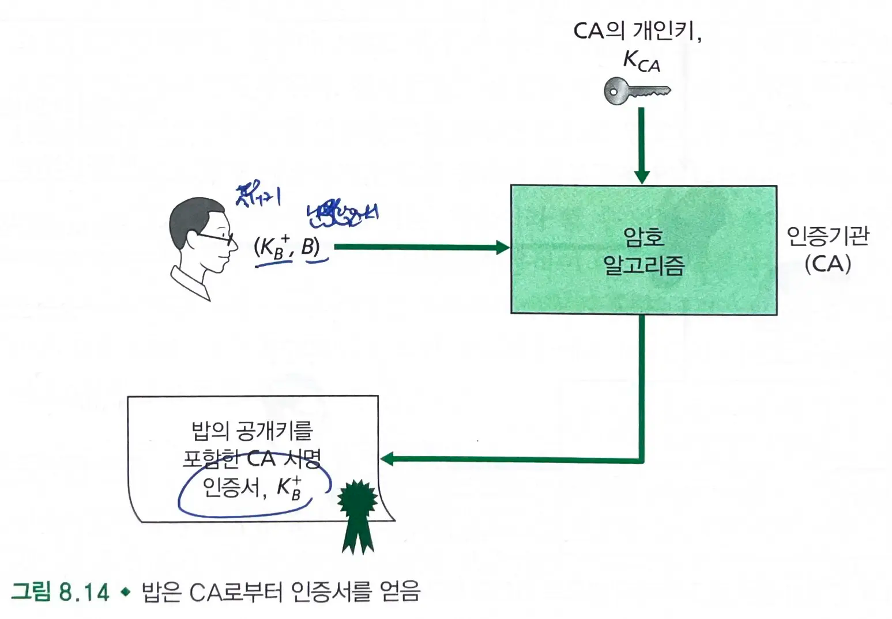

# 8.3. 메세지 무결성과 전자서명

### 메세지 무결성

- 이 메세지가 정말 송신자로부터 온 것인가?
    - 신원을 사칭한 메세지는 아닌가?
- 전달되는 도중에 메세지가 변경되지는 않았는가?

## 8.3.1 암호화 해시 함수

- 입력 `m`을 받아서 해시라 불리는 고정된 크기의 문자열 `H(m)`을 계산한다.
- 암호화 해시 함수 : H(x) = H(y)가 되는 서로 다른 두 메세지 x와 y를 찾는 일이 산술적으로 실행 불가능하다.
    - 원래 메세지와 동일한 해시값을 갖는 다른 메세지를 위조해낼 수 없다.
- 론 리베스트의 MD5 해시 알고리즘과 SHA-1이 오늘날 널리 쓰이고 있다.

## 8.3.2 메세지 인증 코드

- 메세지 무결성을 얻는 방법

### MAC

- `인증키(공유 비밀키, s)`를 서로 공유해야한다.
    - 침입자가 몰래 메세지를 보내는 것을 방지하기 위함이다.
-
    1. 앨리스는 메세지 m을 생성하고 해시 `H(m+s)`을 계산한다. (`H(m+s)`를 `MAC`이라고 부른다).
-
    2. 앨리스는 메세지 m에 MAC을 첨부하여 확장 메세지 `(m, H(m+s))`을 생성한 후 밥에게 보낸다.
-
    3. `확장 메세지 (m, h)`를 받은 밥은 `MAC`을 계산한다. 만일 `H(m+s) = h`라면, 밥은 무결성이 훼손되지 않음을 알 수 있다.
- MAC은 암호화 알고리즘을 필요로 하지 않으며, 오늘날 가장 많이 사용되는 표준은 HMAC이다.
    - HMAC은 해시 함수를 두번 사용하여 데이터와 인증키의 해시값을 계산한다.

## 8.3.3 전자 서명

- 공개키 암호화 기술은 전자서명 구현을 위한 기반 기술로 매우 적합하다.
- 개인키로 암호화(전자서명) 후 공개키로 성공적으로 복호화될 경우, 수신자에게 송신자의 신분 뿐 아니라 메세지가 변형되지 않음을 확인할 수 있다.
    - 메세지 무결성을 제공한다.
- 해시 함수를 전자서명에 이용할 수 있다.
    - 메세지에 해시함수를 수행하면 원래 메세지보다 훨씬 짧으므로 연산 작업의 부하가 줄어든다.
    - 동작
        -
            1. 밥은 긴 메세지에 해시 함수를 적용한 후, 해시 결과에 개인키로 전자서명한다.
        -
            2. 밥은 앨리스에게 해시 결과와 평문 메세지를 전송한다.
        -
            3. 앨리스는 밥의 공개키를 이용하여 해시 결과를 얻고, 평문에도 해시 함수를 적용하여 두 결과를 비교하여 무결성을 검증한다.
- `PGP`는 `전자서명`을 이용하고, `OSPF`와 많은 트랜스포트 계층과 네트워크 보안 프로토콜에서 `MAC`이 사용된다.

### 공개키 인증

- `IPSec`이나 `SSL`을 포함한 많은 대중적인 보안 네트워킹 프로토콜에서 사용된다.
- 만약 침입자의 공개키를 다른 사람의 공개키로 위장하여 메세지를 전송한다면?
    - 공개키가 실제로 보내는 사람의 것인지 확인해야한다.

- `CA(Certification Authority)` : 신원을 확인하고 인증서를 발행한다.
    - CA의 신뢰도만큼 공개키의 주인이라 주장하는 개체의 신원을 믿을 수 있다.
    - CA는 그 개체의 공개키와 신분확인서를 결합한 인증서를 만든다. `인증서`에는 CA가 `전자서명`을 한다.
- 수신자가 `CA`가 서명한 `인증서`를 받으면, 수신자는 `CA의 공개키`로 밥의 인증서의 유효성을 검사하고 `공개키`를 뽑아낸다.

