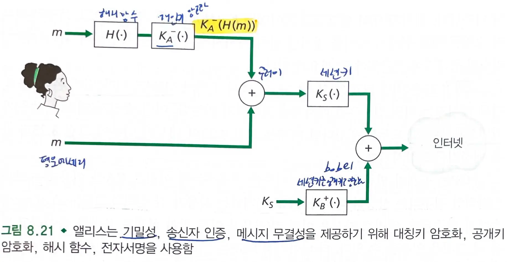
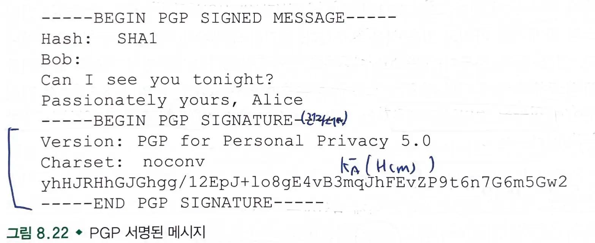
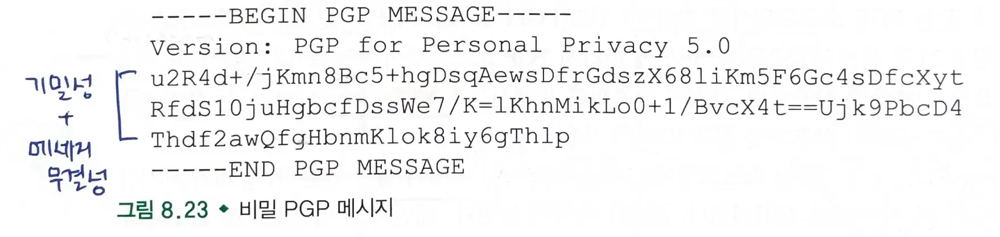

# 8.5 전자우편의 보안

## 8.5.1 보안 전자우편

### 기밀성

- 대칭키 기술
  - 키를 공유하는데 어려움이 있다.
- 공개키 암호화
  - 긴 메세지에 대해 비효율적이다.
- 세션키
  - 세션키를 공개키로 암호화하여 전달한다.
  - 세션키 공유는 공개키로 수행하고, 데이터 전달은 세션키를 사용한다.

### 메세지 무결성 & 수신자 인증

- `메세지 무결성` : 메세지가 전송되는동안 변경되지 않았음을 보장한다.
- `수신자 인증` : 정말 수신자에게 보내고 있는지 검증할 수 있어야한다.
- 이를 달성하기 위해 `전자서명`과 `메세지 요약문(해시)`를 사용한다.
  - 메세지에 해시 함수를 적용하고, 해시 함수의 결과를 개인키로 암호화한다.
  - 공개키로 복호화한 후 결과를 메세지에 해시함수를 적용한 결과와 비교한다.
  - 두 결과가 같으면 메세지 무결성(해시함수) 및 수신자 인증을 검증할 수 있다.

#### 기밀성 & 메세지 무결성 & 수신자 인증

## 8.5.2 PGP (Pretty Good Privacy)

- 전자우편 암호화 기법 중 하나이다.
  - 메세지 요약문 계산 : `MD5`, `SHA`
  - 대칭키 암호화 : `CAST`, `triple-DES`, `IDEA`
  - 공개키 암호화 : `RSA`
- PGP 설치시 소프트웨어는 사용자를 위한 공개키 쌍을 만든다.
  - 전자서명하거나 암호화할 수 있다.

### PGP로 서명된 메세지

- 메세지 무결성을 확인한다.

### 비밀 PGP 메세지

- 메세지 무결성과 기밀성을 보증한다.

### PGP 공개키 인증 메커니즘

- `CA`를 이용하지 않는다.
- PGP 공개키는 사용자간 `신뢰의 그물` 속에서 인증된다.
  - 어떤 키/사용자 이름 쌍이 올바른 쌍이라고 믿으면 그것을 인증할 수 있다.
  - 다른 사용자를 신뢰한다고 말함으로써 다른 키의 진실성을 보증할 수 있다.
- 사용자들은 실제 같은 물리적 공간에 모여서 공개키를 교환하고 그들의 개인키로 서명하는 것으로 서로의 키를 보증한다.

