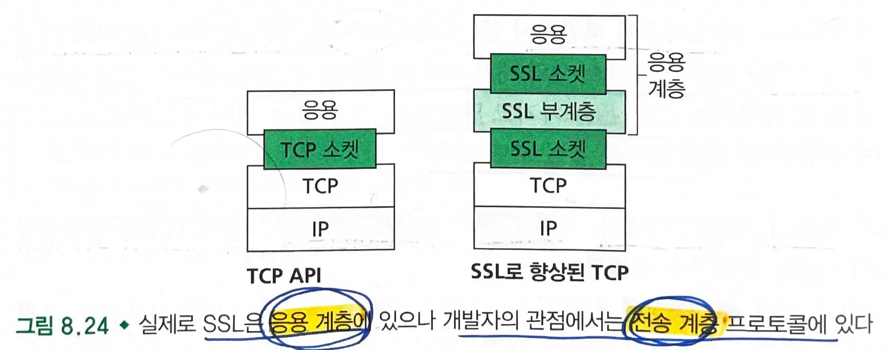
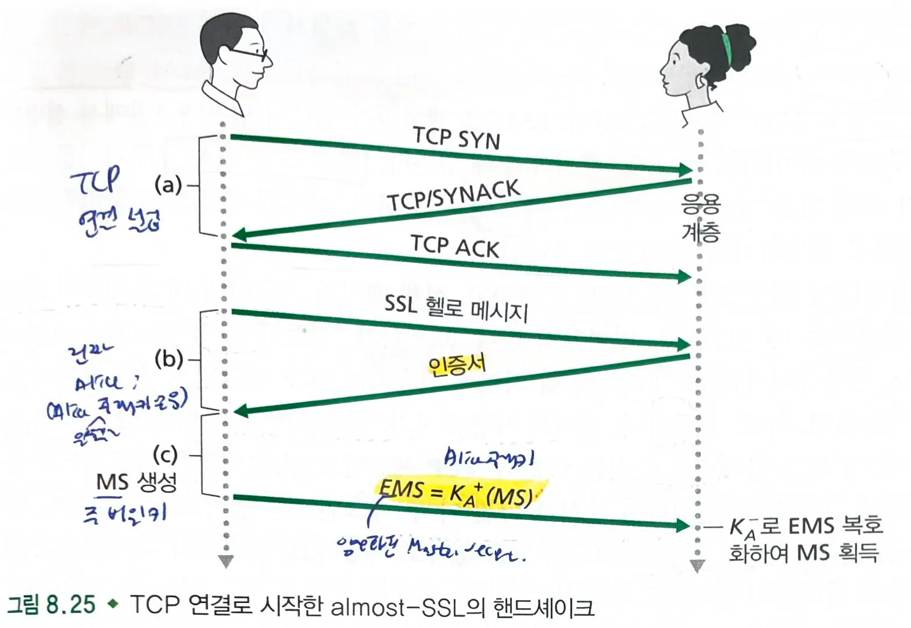
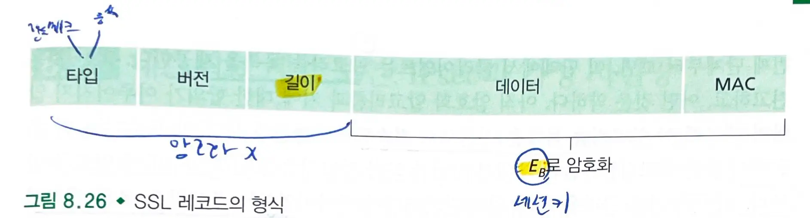
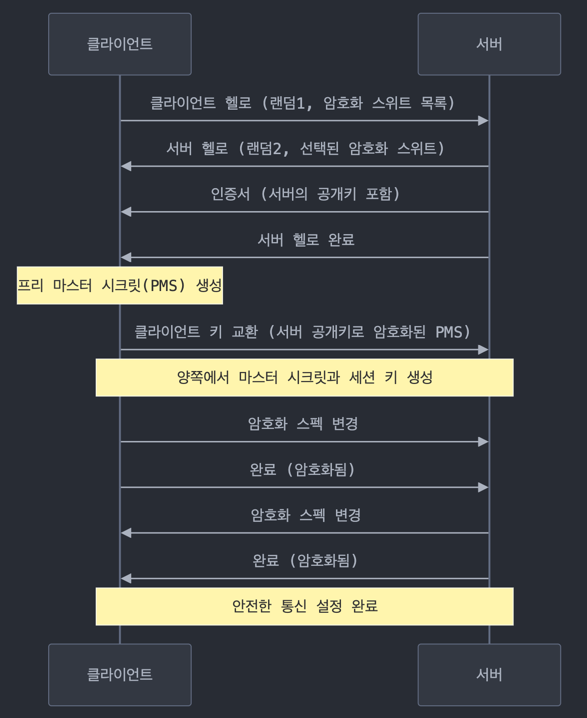

# 8.6. TCP 연결의 보안 SSL

- `SSL` : 향상된 `TCP` 버전
  - `TLS` : `SSL` 버전 3의 약간 변형된 버전
  - `https`로 시작한다면 브라우저가 ssl을 사용하고 있는 것이다.
- SSL의 필요성
  - **SSL은 `기밀성`, `데이터 무결성`, `서버 인증`과 `클라이언트 인증`을 통해 TCP를 향상시킨다.**
  - `기밀성`이 제공되지 않는다면 침입자가 카드 정보를 얻을 수 있다.
  - `데이터 무결성`이 제공되지 않는다면 침입자가 주문을 수정해서 많은 양의 상품을 구매하게 할 수 있다.
  - `서버 인증`이 제공되지 않는다면 침입자는 사칭 사이트를 만들어 돈을 가지고 달아날 수 있다.

- `SSL`은 `TCP`를 보호하기 때문에 `TCP` 상에서 일어나는 어떤 응용에도 사용할 수 있다.
  - SSL은 소켓을 사용하는 간단한 API를 제공한다,
  - SSL은 `응용 계층`에 존재하나 개발자의 관점에서는 `보안 서비스로 강화된 TCP 서비스(전송 계층 서비스)`를 제공한다.

## 8.6.1 SSL 개요

### 핸드쉐이크

- 핸드쉐이크 단계에서 Bob
  -
    1. 앨리스와 TCP 연결을 수행한다.
  -
    2. 앨리스가 진짜 앨리스인지 확인한다.
  -
    3. SSL 세션에 필요한 모든 대칭키를 생성하기 위해 앨리스오 밥이 사용할 주 비밀키(ms)를 앨리스에게 전송한다.

### 키 유도

- 앨리스와 밥이 각각 다른 암호화 키를 사용하고, 암호화와 무결성 검사에도 서로 다른 키를 사용하는 것이 보다 안전하다.
  - 앨리스와 밥은 `MS`를 이용하여 4개의 키를 생성한다.
    - `Eb` : 밥이 앨리스에게 보내는 데이터에 대한 세션 암호화 키
    - `Mb` : 밥이 앨리스에게 보내는 데이터에 대한 세션 MAC 키
    - `Ea` : 앨리스가 밥에게 보내는 데이터에 대한 세션 암호화 키
    - `Ma` : 앨리스가 밥에게 보내는 데이터에 대한 세션 MAC 키
- `암호화 키`는 데이터를 암호화하는데 쓰이고, `MAC 키`는 데이터 무결성을 확인하는데 사용된다.

### 데이터 전송

- `ssl`은 데이터 스트림을 `레코드`(record)로 쪼개고, 각 레코드에 무결성 검사를 위한 `MAC`을 덧붙인다.
  - MAC은 `레코드 데이터`와 순서번호, 키 `Mb`를 `해시 함수`에 넣는다.
- 레코드 + MAC을 암호화한다.
- 순서번호가 달라지면 알아챌 수 있다.

### SSL 레코드

- 타입, 버전, 길이, 그리고 데이터와 MAC 필드로 이루어져 있다.
  - 처음 세 필드는 암호화되지 않는다.

## 8.6.2 보다 완전한 그림

### SSL 핸드쉐이크

- 과정
  -
    1. 클라이언트는 `넌스`와 함께 자신이 지원하는 `암호화 알고리즘의 목록`을 보낸다.
  -
    2. 서버는 `대칭키 알고리즘`, `공개키 알고리즘`, `MAC 알고리즘`을 선택한다. 서버는 `자신의 선택 결과`와 `인증서`, `서버 넌스`를 클라이언트에게 돌려준다.
  -
    3. 클라이언트는 `인증서`를 확인하고 서버의 `공개키`를 알아낸 후 `PMS(Pre-Master Secret)`를 생성한다.
  -
    4. 클라이언트와 서버는 같은 키 유도 함수를 사용하여 `PMS`와 `넌스`로부터 독립적으로 `MS`를 계산한다. `MS`는 **두개의 암호화 키**와 **두개의 MAC 키**를 생성하기 위해 분할된다.
  -
    5. 클라이언트는 모든 핸드쉐이크 메세지의 `MAC`을 전송한다.
  -
    6. 클라이언트는 모든 핸드쉐이크 메세지의 `MAC`을 전송한다.
- 마지막 두 단계는 핸드쉐이크가 훼손되는 것을 방지한다.
  - 알고리즘 선택시 강한 알고리즘을 제거하는 공격(훼손 공격)을 막는다.
- 넌스는 재생 공격을 막는다.
  - 각 TCP 연결마다 서로 다른 넌스를 보내므로 암호화 키가 달라져 연결 재생 공격에 대응할 수 있다.
- 순서번호는 각 패킷의 순서를 바꾸는 공격을 막는다.
  - 순서번호는 진행 중인 세션에서 개별 패킷들의 재생에 대응하기 위해 사용된다.

### 연결 종료

- 밥이 앨리스에게 `TCP FIN 세그먼트`를 보내어 SSL 세션을 종료한다.
- **절단 공격** : 침입자가 `TCP FIN`을 이용하여 SSL 세션을 일찍 종료하게 할 수 있다.
  - 레코드의 `타입 필드`에 `SSL 종료 수행 여부`를 표시하면, 수신측에서 `MAC`을 이용하여 인증할 수 있다.

