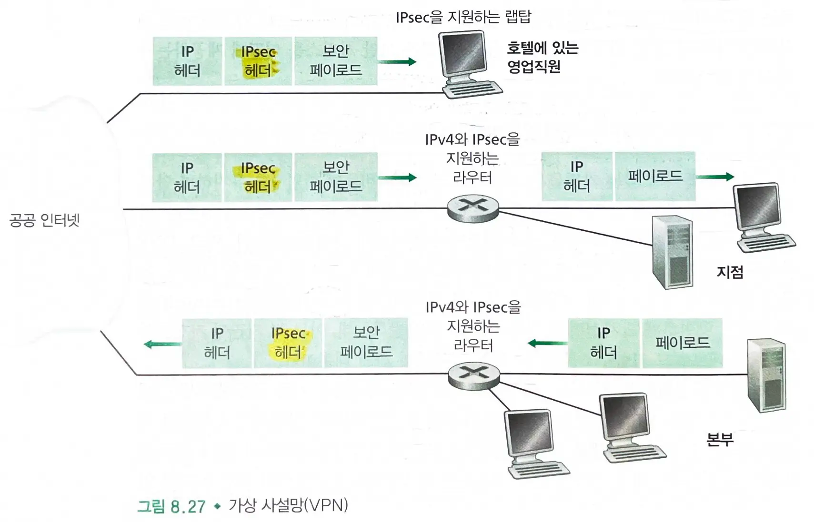
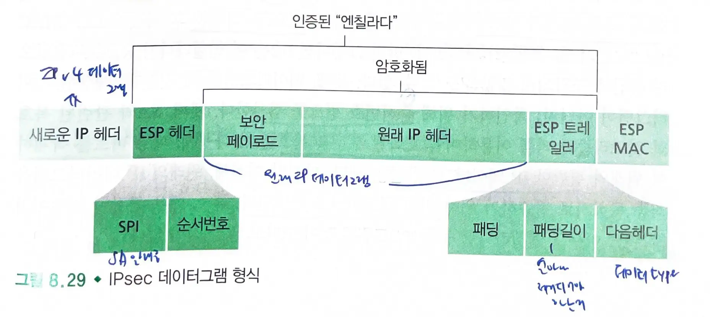

# 8.7 네트워크 계층 보안 IPsec과 가상 사설망

### IPsec

- 네트워크 계층의 보안을 제공한다.
- 네트워크 계층의 어떤 두 개체 사이에서 IP 데이터그램을 보호한다.
- 많은 기관들은 공공 인터넷 상에 가상 사설망(VPN)을 구축하기 위해 IPsec을 사용한다.

## 8.7.1 IPsec과 가상 사설망(VPNs)

### 사설망

- 공공 인터넷과 분리된 라우터, 링크, DNS 시스템을 포함하는 **물리적으로 독립된 네트워크**

> 사설망을 구축하는 대신, **오늘날 많은 기관들은 기존 공공 인터넷 상에 VPN을 구축한다.**

- `VPN`을 이용하면 트래픽은 공공 인터넷을 통해 전송되지만, `기밀성`을 제공하기 위해 공공 인터넷에 들어가기 전에 `암호화`된다.

### VPN

- 내부의 두 컴퓨터는 기존의 평범한 IPv4 망을 사용한다.
- 그러나 두 호스트가 공공 인터넷을 통과하는 경로를 이용해서 통신을 할 때는 트래픽이 인터넷에 들어가기 전에 암호화된다.

#### 과정

- 본부의 게이트웨이 라우터는 평범한 `IPv4 데이터그램`을 `IPsec 데이터그램`으로 바꾼 후 인터넷으로 전송한다.
  - IPsec 데이터그램은 전형적인 IPv4 헤더를 가지고 있어서 공공 인터넷의 라우터들은 평범한 IPv4 데이터그램인 것처럼 처리한다.
- `IPsec 데이터그램`은 `IPsec 헤더`를 포함하고 `페이로드는 암호화`한다.

## 8.7.2 AH와 ESP 프로토콜

### IPsec 프로토콜

- `AH 프로토콜`과 `ESP 프로토콜`이 있다.
  - `AH 프로토콜`: 출발지 인증, 데이터 무결성, 기밀성
  - `ESP 프로토콜` : 출발지 인증, 데이터 무결성
- 기밀성이 다른 프로토콜들에 필수적이므로 ESP 프로토콜이 AH 프로토콜보다 훨씬 널리 사용된다.

## 8.7.3 SA (Security Associations)

- `IPsec 데이터그램`을 전송하기 전에 출발지 개체와 목적지 개체는 네트워크 계층에서 `논리적 연결(SA)`을 설립한다.
  - SA는 단방향 연결이므로 양방향으로 데이터그램을 전송하기 위해 2개의 SA가 필요하다.
- `게이트웨이 라우터`는 일반적인 `IPv4 데이터그램`과 `IPsec 데이터그램` 둘 다 인터넷으로 전송한다.
- 라우터는 각 SA에 대해 상태 정보를 포함한다.
  - SA에 대한 32비트 식별자 `SPI`
  - SA 시작점의 인터페이스와 최종점의 인터페이스
  - 사용되는 암호화 타입
  - 암호키
  - 무결성 검사 타입
  - 인증키
- 라우터는 SA에 대한 IPsec 데이터그램을 생성할 때마다 `상태 정보`에 접근한다.
  - 라우터는 각 SA에 대한 상태 정보를 유지한다.
- IPsec 개체는 모든 SA에 대한 상태 정보를 그 개체의 OS 커널에 있는 `SAD`(Security Association Database)에 저장한다.

## 8.7.4 IPsec 데이터그램

- IPsec은 `터널 모드`와 `전송 모드`라는 패킷 형식을 가진다.
  - 터널 모드가 VPN에 더 적합하기 때문에 더 널리 사용된다.

### 출발 라우터 변환 과정

- 라우터는 아래 과정을 통해 `원본 IPv4 데이터그램`을 `IPsec 데이터그램`으로 변환한다.
  - 원 IPv4 데이터그램의 뒤에 `ESP 트레일러`를 덧붙인다.
  - SA에 의해 지정된 알고리즘과 키를 이용하여 위의 결과를 `암호화`한다.
  - 암호화된 결과의 앞에 `ESP 헤더` 필드를 덧붙인다.
    - 결과로 나온 패키지를 엔칠라다라고 부르겠다.
  - SA가 지정된 알고리즘과 키를 이용하여 전체 엔칠라다에 대한 `인증 MAC`을 생성한다.
  - 엔칠라다 뒤에 MAC을 붙여 페이로드를 만든다.
  - 전형적인 IPv4 헤더 필드를 가지고 완전히 `새로운 IP 헤더`를 만들어 페이로드 앞에 붙인다.
- 결과로 나온 IPsec 데이터그램은 전형적인 IPv4 헤더를 가지고 페이로드가 따라오는 진짜 IPv4 데이터그램이다.
  - IPsec 데이터그램의 출발지와 목적지 주소는 터널의 양 끝에 있는 출발지와 목적지 라우터 인터페이스 주소이다.
  - 새로운 상위 IPv4 헤더 필드의 상위 프로토콜 필드 값으로는 TCP나 UDP, SMTP가 아닌 ESP 프로토콜을 사용하는 IPsec 데이터그램이라는 것을 뜻하는 `50`을 사용한다.
- IPsec 개체는 `SAD`와 함께 `SPD`를 유지한다.
  - SPD는 어떤 형태의 데이터그램이 IPsec으로 처리되어야 하는지와 그때 사용될 SA를 지시한다.

#### ESP 트레일러

- `패딩`, `패딩 길이`, `다음헤더`
- 블록 암호화 방법에서 암호화될 메세지는 지정된 블록 길이의 정수배이어야한다.
  - 패딩은 원래 데이터그램에 덧붙어 최종 메세지가 정수개의 고정 길이 블록으로 분할될 수 있도록 한다.
  - 다음 헤더 필드는 페이로드에 포함된 데이터 타입(ex) UDP)를 지시한다.

#### ESP 헤더

- 두개의 필드-SPI와 순서번호로 이루어져 있다.
  - SPI : 수신 개체에서 데이터그램이 어느 SA에 속해 있는지 지시한다.
    - 수신 개체는 해당 SPI를 가지고 자신의 SAD를 검색하여 알맞은 인증 및 복호화 알고리즘과 키를 결정한다.
  - 순서번호는 재생 공격에 대응하기 위해 사용된다.

### 도착 라우터  IPsec 데이터그램 처리 과정

- 상위 프로토콜 필드 값이 `50`이므로 라우터는 데이터그램에 `IPsec ESP 프로토콜`을 적용해야 한다는 것을 알게 된다.
- `SPI`를 이용하여 데이터그램이 어느 `SA`에 속한 것인지 알아낸다.
- 엔칠라다의 `MAC`을 계산한 후 ESP MAC 필드의 값과 일치하는지 확인한다.
- 데이터그램의 `순서번호`를 확인하여 재생 공격이 아닌지 검증한다.
- SA와 관련된 복호화 알고리즘과 키를 이용하여 암호화된 부분을 `복호화`한다.
- 패딩 비트를 삭제하여 원래의 평범한 IP 데이터그램을 뽑아낸다.
- 원래의 IP 데이터그램을 최종 목적지로 전송하기 위해 지점 네트워크로 전달한다.

> IPsec은 기밀성, 출발지 인증, 데이터 무결성, 재생 공격에 대한 대응책을 제공한다.

## 8.7.5 IKE : IPsec에서의 키 관리

- `IKE`(Internet Key Exchange) 프로토콜 : SA를 생성하는 자동화된 방법
- **첫번째 메세지 교환** : 양측이 라우터 사이의 양방향 IKE SA를 설립하기 위해 `Diffie-Hellman 알고리즘`을 사용한다.
  - RSA의 공개키와 비밀키가 사용되지 않는다. (신분을 드러내지 않는다)
  - 두 라우터 사이의 인증되고 암호화된 채널을 제공한다.
- **두번째 메세지 교환** : 양측이 메세지에 서명함으로써 **서로에게 신분을 드러낸다.**
  - 메세지가 보안처리된 IKE SA 채널을 통해 전송되므로 신분이 누설되지는 않는다.
  - 양측이 IPsec SA에 의해 사용될 IPsec 암호화 및 인증 알고리즘에 대해 협의한다.
  - 두개의 SA에 대한 암호화 및 인증 세션키를 만든다.
- 두 단계인 이유는 두번째 단계에 공개키 알고리즘을 포함하지 않음으로써 상대적으로 낮은 연산 비용으로 두 IPsec 개체 사이에 매우 많은 수의 `SA`를 생성할 수 있다.

