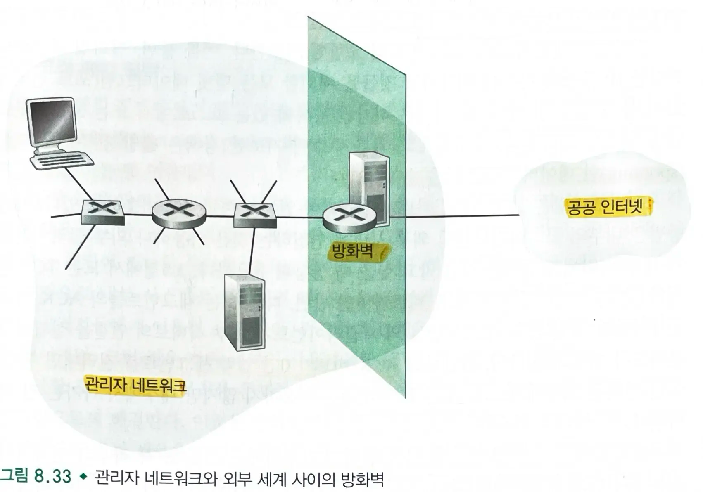

# 8.9 운영 보안 - 방화벽과 침입 탐지 시스템

## 8.9.1 방화벽

### 방화벽이란?

- 전체 인터넷으로부터 기관의 `내부 네트워크`를 분리시킨 하드웨어와 소프트웨어의 조합
  - 어떤 패킷들은 **통과**되지만 다른 패킷들은 **차단**된다.
- `네트워크 관리자`가 해당 네트워크에 대한 **트래픽 출입을 관리**함으로써 외부 세계와 관리 네트워크 내 자원간의 `접근을 제어`한다.
- Cisco 나 체크포인트는 방화벽 시장을 주도하고 있으며, iptable을 이용하여 리눅스 기반의 방화벽(패킷 필터)를 만들 수 있다.

### 방화벽의 목표

- **외부와 내부를 오가는 모든 트래픽은 방화벽을 거친다.**
  - 하나의 방화벽을 네트워크의 유일한 접속 포인트에 두는 편이 보안 접근 정책의 관리/강화를 용이하게 한다.
- **로컬 보안 정책에 정의된 대로 승인된 트래픽만이 통과가 허용된다.**
  - 모든 트래픽이 바오하벽을 통과하게 함으로써 외부의 접근을 승인된 트래픽만으로 제한할 수 있다.
- **방화벽 자체가 침입 시도에 안전해야 한다.**
  - 침입자에 의해 조작된다면 방화벽이 없는 것보다 더 나쁜 결과를 초래하게 된다.

> 방화벽은 `전통적인 패킷 필터`, `상황 고려 필터`, `응용 게이트웨이`로 분류된다.

### 전통적인 패킷 필터

- 하나의 기관은 일반적으로 내부의 네트워클르 ISP에 연결하는 `게이트웨이 라우터`를 가진다.
  - 내부 네트워크에 대한 모든 입출력 트래픽은 이 라우털르 통과해야하고, 이 라우터에서 패킷 필터링이 일어난다.
- 필터링 결정 사항
  - IP 출발지 또는 목적지 주소
  - IP 데이터그램 내의 프로토콜 타입 : TCP, UDP, ICMP, OSPF
  - TCP 또는 UDP 출발지와 목적지 포트
  - TCP 플래그 비트 : SYN, ACK
  - ICMP 메세지 타입
  - 네트워크에서 나가는 데이터그래모가 들어오는 데이터그램에 대한 서로 다른 규칙들
  - 서로 다른 라우터 인터페이스에 대한 서로 다른 규칙들

#### 패킷 필터링 규칙들

- 필터링 규칙은 `주소`와 `포트 번호`의 조합에 기초한다.
  - 외부 주소에 기초한 정책은 출발지 주소를 위장(spoofing)한 데이터그램을 막을 수 없다.
- 필터링은 `TCP ACK 비트`가 설정되어있는지 아닌지에 기초한다.
  - 모든 TCP 연결의 첫번째 세그먼트는 ACK 비트가 0인 반면, 다른 모든 세그먼트들의 ACK 비트는 1이다.
  - 외부 클라이언트가 내부 서버로의 연결을 설립하지 못하도록 하길 원한다면, 간단하게 `ACK 비트가 0인 입력 세그먼트`를 걸러내면 된다.
  - 내부의 클라이언트들이 외부 서버에 연결하는 것은 가능하나 외부 클라이언트가 내부 서버에 연결하는 것은 막고 싶을때 유용하다.

#### 라우터 인터페이스 접속 제어 목록

- 방화벽의 규칙은 접속 제어 목록과 함께 라우터에 구현된다.
- 처음 두 규칙은 내부 사용자의 웹서핑을 가능하게 한다.
- 다음 두 규칙은 DNS 패킷들의 출입을 허용한다.
- 위 라우터는 기관 내부에서 시작된 웹 트래픽과 DNS 트래픽을 제외한 모든 트래픽을 막는다.

### 상황 고려 패킷 필터

- `전통적인 패킷 필터`에서는 패킷 차단 결정이 각 패킷에 대해 따로 따로 이루어진다면, `상황 고려 필터`는 TCP 연결을 추적하여 패킷 차단 결정을 하는데 이용한다.
- 만약 ACK=1과 출발지 포트 80을 가진 조작된 패킷이 들어온다면?
  - 상황 고려 필터는 연결 테이블에 있는 진행중인 모든 TCP 연결을 추적함으로써 해결한다.
  - 방화벽은 세 방향 핸드쉐이크를 통해 새로운 시작을 알 수 있고, 연결에 대해 FIN을 발견함으로써 연결의 종료를 알 수 있다.
  - 위의 조작된 패킷은 진행중인 어떠한 TCP 연결에도 속하지 않으므로 패킷을 버린다.

### 응용 게이트웨이

- 만일 어떤 기관이 내부 사용자 중 제한된 범위의 사용자만 텔넷 서비스를 제공하고자 한다면?
  - 내부 사용자의 신원에 대한 정보는 응용 계층의 데이터이며 IP/TCP/UDP의 헤더에는 포함되지 않는다.
  - 좀 더 세밀한 수준의 보안을 위해서 방화벽은 `패킷 필터`를 `응용 게이트웨이`와 결합시켜야 한다.
- `응용 게이트웨이` : 모든 응용 데이터가 반드시 통과해야 하는 응용 맞춤 서버
  - IP/TCP/UDP 헤더 이상의 것을 살펴보고, 응용 데이터에 기초한 정책 결정을 한다.

#### 응용 게이트웨이의 단점

- 각 응용마다 서로 다른 `응용 게이트웨이`를 필요로 한다.
- 모든 데이터가 게이트웨이를 경유하여 중계되므로, **성능상의 손실**이 있다.
- 클라이언트 소프트웨어는 사용자가 요구할 때 어떻게 게이트웨이와 통신하는지 알아야하며, 어떤 외부 서버에 연결할지 응용 소프트웨어에 알려줄 수 있어야 한다.

#### 익명성과 사생활 보호

- 만약 논란이 많은 웹사이트(ex) 정치적 운동 사이트)를 방문하는데 기록을 남기고 싶지 않다면?
  -
    1. 웹사이트에 IP 주소를 남기고 싶지 않을 때
  -
    2. 지역 ISP가 이 사이트를 접속했다는 사실을 알리고 싶지 않을 때
  -
    3. 방문한 사이트에서 하는 행동들을 지역 ISP가 보는 것을 원하지 않을 때
- SSL을 사용한다 할지라도 1,2번은 충족시키지 못한다.
- **신뢰할 수 있는 서버와 SSL의 조합 방법**
  - 먼저 신뢰할 수 있는 프록시와 SSL 연결을 설립한 후, 연결을 통해 접속을 원하는 사이트에 대한 HTTP 요청을 전송한다.
  - 프록시는 SSL로 암호화된 HTTP 요청을 받으면 복호화하여 평문으로 해당 웹사이트에 요청을 보낸다.
  - 프록시가 웹사이트의 응답을 받으면 SSL을 통해 응답을 암호화하여전달한다.
  - 프록시와의 모든 트래픽이 암호화되므로 사생활을 침해할 수 없다.
  - 하지만 프록시는 모든 것을 알고 있기 때문에, 이 트래픽들은 프록시를 신뢰할 수 있는 만큼만 믿을 수 있다.
- **TOR 익명성 및 사생활 서비스**
  - 트래픽을 서로 공모하지 않은 몇 개의 연속적인 `프록시 서버`에 통과시킨다.
  - TOR은 개인이 프록시 풀에 프록시를 제공하는 것을 허용한다.
  - 사용자가 TOR을 사용해서 서버에 접속하면 TOR은 `3개의 프록시로 구성된 체인`을 임의로 선택하여 모든 트래픽을 체인상으로 전송한다.
  - 프록시들이 서로 공모하지 않는다고 가정한다면, 해당 웹사이트와의 통신은 누구와도 알지 못한다.
  - 마지막 프록시와 서버 간에 **평문**으로 전달한다 할지라도 마지막 프록시는 어떤 IP 주소를 가진 호스트가 그 평문을 주고받는지 알지 못한다.

> 하지만 최근에 TOR은 몇몇 국가의 노드장악으로 인해 익명성에 대한 논란이 일고 있다.

## 8.9.2 침입 탐지 시스템

### 자세한 패킷 관찰

- 다양한 형태의 공격을 탐지하기 위해서는 헤더 필드 내용 외에도 패킷이 가지고 있는 실제 응용 데이터까지 살펴보는 것이 필요하다.
- 응용 게이트웨이는 종종 자세한 패킷 관찰을 한다.
  - 하지만 하나의 응용 게이트웨이는 한가지 특정한 응용에 대해서만 수행된다.

### 침입 탐지 시스템 (IDS)

- 악의적일 수 있는 트래픽을 발견했을 때 경고를 발생시키는 장치

### 침입 방지 시스템 (IPS)

- 의심스러운 트래픽을 걸러내는 장치

> 이 책에서는 IDS와 IPS 시스템을 통틀어 IDS 시스템으로 호칭한다.

- 오늘날 수천의 기관들이 IDS 시스템을 이용한다.
- 설치된 많은 IDS 시스템들이 유명한 스노트(Snort) IDS 시스템과 같은 공개 도메인 시스템이다.

### 여러개의 IDS 센서

- 하나의 가관에서 내부 네트워크에 **두 개 이상의 IDS 센서**를 설치할 수도 있다.
  - 여러개의 센서가 설치되면 일반적으로 함께 협조하며 일한다.
  - 의심스러운 트래픽에 대한 정보가 `중앙 IDS 프로세서`에 전달된다.
  - `중앙 프로세서`는 의심스러운 정보를 수집하고 통합하여 적당한 때에 네트워크 관리자에게 알린다.
- `IDS`는 지나가는 각각의 패킷을 수만개의 시그니처와 비교해야하므로, 연산 양을 분배하기 위해 여러개의 IDS 센서를 둔다.

### DMZ(비무장 지대)

- `패킷 필터`와 `IDS 센서`만 사용하는 낮은 보안 구역
  - 반면에, 높은 보안 구역은 `패킷 필터`와 `응용 게이트웨이`에 의해서 보호되고, `IDS 센서`에 의해 감시된다.
- 공공의 웹서버, 공인된 DNS 서버와 같은 외부 세계와 통신할 필요가 있는 기관의 서버들을 포함한다.

### IDS 시스템 분류

#### 시그니처 기반 시스템

- 공격 시그니처에 대한 `방대한 데이터베이스`를 유지한다.
- 각 `시그니처`는 침입 행위에 관련된 규칙들의 집합이다.
  - 시그니처는 단순히 단일 패킷에 대한 특징의 목록일 수도 있고, 연속된 일련의 패킷들에 관련되어 있을 수도 있다.
- 한 기관의 네트워크 관리자는 시그니처를 자신에 맞게 수정하고 db에 추가할 수 있다.
- 한계
  - 아직 기록되지 않은 새로운 공격에는 대비할 수 없다.
  - 모든 패킷이 시그니처와 비교되어야하므로 막대한 연산을 다 처리하지 못해 실제로 많은 악의적인 패킷을 감지하지 못할 수 있다.

#### 이상 기반 시스템

- 평소에 트래픽을 관찰할 때 **트래픽 분석표**를 만든다.
- 통계학적으로 `비정상적인 패킷의 스트림`을 찾는다.
  - ex) ICMP 패킷의 빈도가 높다던지, 포트 정보 수집과 ping 메세지가 증가한다던지
- 일반적인 트래픽과 통계학적으로 이상한 트래픽을 구분하는 것은 어려운 문제이다.

> 지금까지 설치된 대부분의 IDS 시스템은 주로 시그니처 기반 시스템이다.

### 스노트(Snort)

- 수십만의 시스템에 설치된 공공 도메인의 `공개 소스 IDS`이다.
- `시그니처 데이터베이스`를 유지하고 있는 사용자와 보안 전문가들의 **거대한 커뮤니티**를 가지고 있다.
  - 새로운 공격이 나타나면 몇 시간 안에 커뮤니티는 공격 시그니처를 작성, 배포하고 세계 곳곳의 수십만 스노트 시스템에 다운로드된다.
- 스노트 시그니처 구문을 이용하여 네트워크 관리자들은 존재하는 시그니처를 수정하거나 완전히 새로운 것을 만듦으로써 시그니처를 생성할 수 있다.

